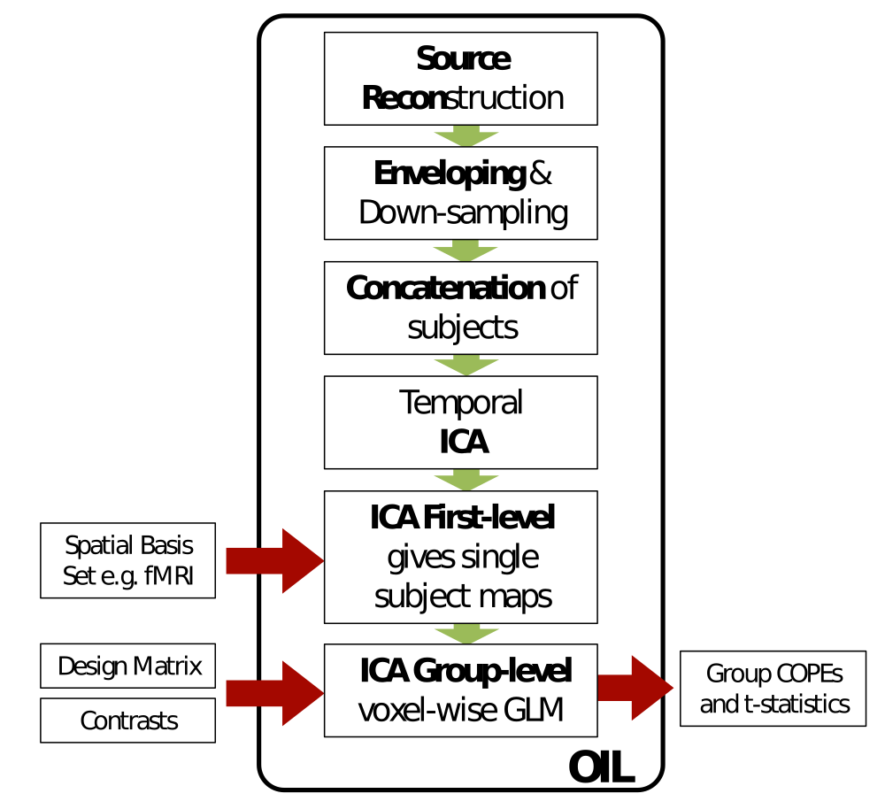
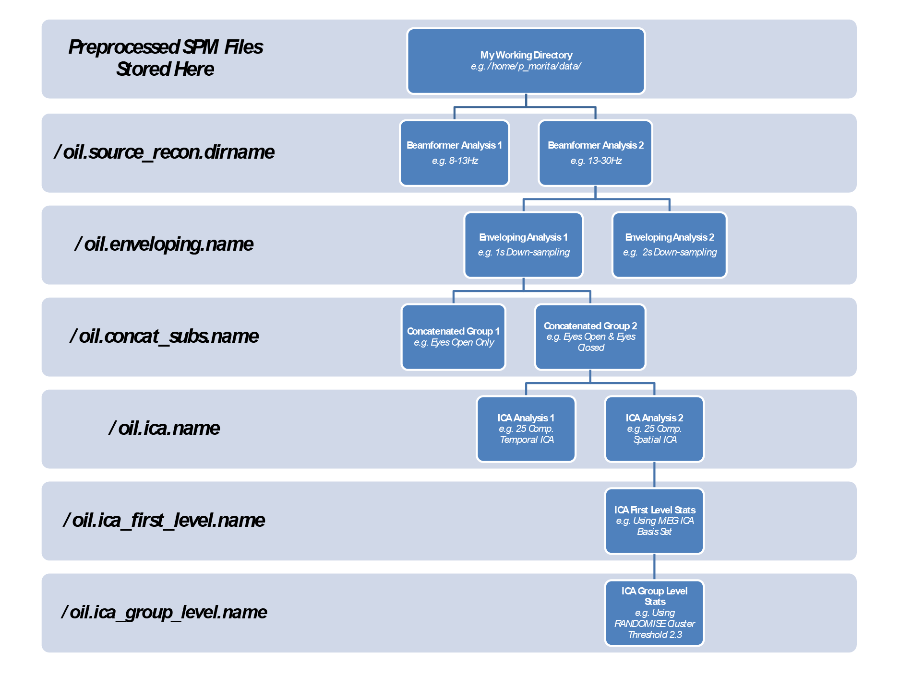

* TOC
{:toc}

OSL includes a framework for extracting functionally-connected networks from MEG data using Independent Component Analysis (ICA). This pipeline can be used to analyse resting-state and task-positive data. In addition, the pipeline is setup to handle both continuous and epoched data. It can be applied to resting state data and task-positive data. OIL can be used in a very similar way to OSL's OAT analyses.

### Data input

OIL assumes that the MEG data has been preprocessed (e.g. using OSL) to create an SPM MEEG object for each subject. 

For a continuous data analysis, you must input:

the continuous data SPM MEEG object
For an epoched data analysis, you must input either:

just the epoched data SPM MEEG object, or 
the epoched data SPM MEEG object, plus the continuous data SPM MEEG object (recommended)

Note that:
 any SPM MEEG object filenames should be provided with a .mat file extension
 any structural filenames should be provided with a .nii file extension

### Output

There are a large number of possible outputs from an OIL analysis. Here is a quick list of a few major ones:

1. ICA maps are saved to the directory '/oil.ica.name/' subdirectory. The full path name can be accessed from oil.ica.results.maps.
2. ICA outputs are stored in the oil.ica.results structure. 
3. If temporal ICA is run then use oil.ica.results.tICs & oil.ica.results.mixing_matrix.
4. If spatial ICA is run then use oil.ica.results.sICs & oil.ica.results.mixing_matrix.

Single Subject Spatial Maps are saved to the directory '/oil.ica_first_level.name/' subdirectory. The full path name can be accessed from oil.ica_first_level.results fields.

Group Analysis Maps are saved to the directory '/oil.ica_group_level.name/' subdirectory. The full path name can be accessed from oil.ica_group_level.results fields.

### Regional power analyses

Analyses of the mean and variance of the power in a region of interest can be performed using a mask. 

The function `osl_get_source_power_in_mask.m` will provide the mean and variance of the power within a masked region, for a set of sessions. 

You must provide:
- a binary nifti mask file, and
- either an oil or oat structure, containing results from the oil or oat pipelines after enveloping has been run
- or a set of nifti files holding power envelopes can be used for analysis. 

### Resting State ICA pipeline

{:style="max-height: 400px;"}

OIL has 6 distinct stages:

Source reconstruction using the OSL beamformer
This calls the same beamformer used in an OAT analysis.

Estimation of the low frequency power signals (via the down-sampled oscillatory amplitude envelope).
Each voxel time course is reconstructed. 
The envelope of each voxel time course is estimated via the Hilbert transform.
The envelope at each voxel is "down-sampled" using a windowed-average.
Spatial Smoothing and re-sampling is also performed at this stage.
Non-weights-normalised envelopes are also estimated at this stage.
Variance maps are also produced.

Concatenation of subjects.
Each voxel can be demeaned (default).
Each subject can also be normalised (not default).
Each voxel can be variance normalised (not default).
The non-weights-normalised concatenated data is also produced. No demeaning nor variance normalisation is performed when concatenating the non-weights-normalised data.

ICA decomposition of concatenated data.
ICA decomposes the data into a set of spatial maps and time courses
By default temporal ICA is used. This forces the time courses to be temporally independent.
Spatial ICA can be performed instead.
ICASSO can be used to minimise the issues related to ICA initialization.

First-level statistics.
At the first level stage, the spatial maps derived from the temporal ICA are used as a spatial basis set to estimate pseudo-compontent time courses via a multiple regression onto the concatenated non-weights-normalised envelopes.
Alternative spatial basis sets (such as those derived from fMRI) can be fed in via the oil.ica_first_level.spatial_basis_set field (by providing a full path to the NIFTI file).
Individual subject maps are then estimated by regressing the subject specific segment of the pseudo-time courses from that subject's non-weights-normalised envelopes.

Group-level statistics.
This is a voxel-wise GLM testing for group comparisons defined by oil.ica_group_level.group_design_matrix and oil.ica_group_level.group_contrast.
FSL's Randomise function can be used to run permutation testing to account for voxel-wise multiple comparisons.
Each stage must be run at least once.Stages 1-4 are very similar for resting-state and task-positive analyses. 

### Task-positive ICA pipeline

OIL has 6 distinct stages:

Source reconstruction using the OSL beamformer
This calls the same beamformer used in an OAT analysis.

Estimation of the low frequency power signals (via the down-sampled oscillatory amplitude envelope).
Each voxel time course is reconstructed. 
The envelope of each voxel time course is estimated via the Hilbert transform.
The envelope at each voxel is "down-sampled" using a windowed-average.
Spatial Smoothing and re-sampling is also performed at this stage.

Concatenation of subjects.
Each voxel is demeaned.
Each subject can also be normalised
Each voxel can be normalised.

ICA decomposition of concatenated data.
ICA decomposes the data into a set of spatial maps and time courses
By default temporal ICA is used. This forces the time courses to be temporally independent.
Spatial ICA can be performed instead.
ICASSO can be used to minimise the issues related to ICA initialization.

First-level statistics.
A continuous time GLM can be used to test each temporally independent component for task-dependence at the subject level.
The GLM is fit to the subject specific section of the tICs.

Group-level statistics.
The first-level statistics are passed to a group-level GLM.
Each stage must be run at least once.Stages 1-4 are very similar for resting-state and task-positive analyses. 

### The OIL structure

The OIL structure has the following fields.
paradigm
either 'task' or 'rest' depending on the analysis being run.
fname
This is the full path to a directory containing oil.mat.
source_recon
Contains the parameters for the beamformer.
enveloping
Contains the enveloping parameters.
concat_subs
Contains the concatenation parameters.
ica
Contains the ICA parameters
ica_first_level
Contains the first level parameters.
ica_group_level
Contains the group level analysis parameters.

### OIL Directory Structure

{:style="max-height: 400px;"}

The OIL analysis saves all the files in a standard file hierarchy.

At each stage of the analysis a new sub directory is  created using the .name field of the relevant substructure. 

E.g.
If I run a temporal ICA analysis and oil.ica.name is set to "tempICA" then the results of that analysis and all susequent branches will be saved in the /tempICA/ directory.
If I then change to a spatial ICA analysis and update oil.ica.name to "spatICA" all future analyses will be saved in the /spatICA/ subdirectory.
In addition the OIL structure itself is always saved in 

[pwd '/' oil.source_recon.dirname '_' oil.enveloping '_' oil.concat ' _' subs.name '_' oil.ica.name '_' oil.ica_first_level.name '_' oil.ica_group_level.name '/oil.mat']

This file is saved as oil.fname.

osl_check_oil will set initial name fields but you must update them over time if needed.

In principle, this should facilitate branching analyses such as split half validations, spatial vs temporal ICA runs, multiple model orders etc...