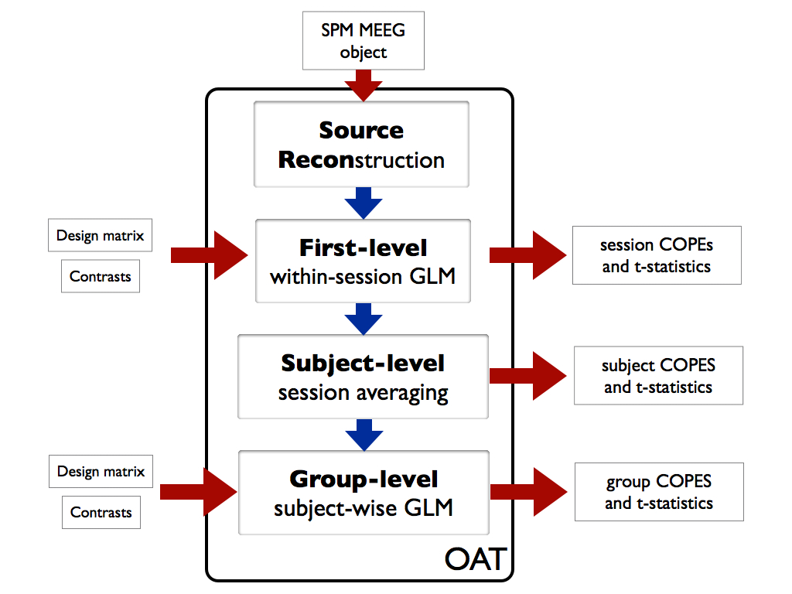

* TOC
{:toc}

## Overview

OAT can be used to analyse a multi-subject MEG study from subject specific SPM MEEG objects through to group statistics in source or sensor space.

OAT automates as many of the analysis decisions as possible, and allows easy (though still robust, efficient and valid) analysis of simple experiments whilst giving enough flexibility to also allow sophisticated analysis of the most complex experiments. 

This includes:

- analysis in sensor or source space
- source reconstruction using whole brain, or regions of interest
- first-level (within-subject) analysis:
    - trial-wise GLM modeling on epoched data
    - time-wise GLM modeling on continuous data
    - time domain or time-frequency (e.g. using Hilbert Transform or Morlet Wavelets)
- group-level (between-subject) subject-wise GLM modeling (fixed or random effects)
- non-parametric (permutation tested) 3D or 4D cluster corrected statistics at the group level

**Combining multiple OAT runs (including adding new sessions or re-running subsets of sessions**

A common issue is running OAT separately on different session or subjects using separate calls to `osl_run_oat` for each one. This can happen when adding new sessions, or perhaps when re-running a "problem" session.

For this to work, the key is keep the following oat settings fixed over each call to `osl_run_oat`: 

- the `oat.source_recon.dirname`, and 
- the list of input files, other than those concatenated on the end (e.g. any new sessions).

To run OAT on different sessions in different calls to `osl_run_oat`, simple change the `oat.source_recon.sessions_to_do` & `oat.first_level.sessions_to_do` etc for each run. These are set using the indexes of each sessions - so if you appended 3 new sessions to input files this would be something like:
    
    oat.first_level.sessions_to_do = len(input_files)-3:len(input_files);

When all sessions have been run, you can then use a call to:

    oat=oat_consolidate_results(oat);

This will mine the `oat` directory and combine together the results it can find. 

**Template script**

There is a template script for running OAT to do a wholebrain source-space ERF OAT analysis, it can be found in the OSL directory and is called:

    osl_example_beamformer_full_pipeline.m


## Data input

OAT assumes that the MEG data has been [preprocessed](preprocessing.md) (e.g. using OSL) to create an SPM MEEG object for each subject. 

For a continuous data analysis, you must input:

- the continuous data SPM MEEG object

For an epoched data analysis, you must input either:

- just the epoched data SPM MEEG object, or 
- the epoched data SPM MEEG object, plus the continuous data SPM MEEG object _(recommended)_

Note that:

- any SPM MEEG object filenames should be provided with a .mat file extension
- any structural filenames should be provided with a .nii file extension

## Export trialwise Fieldtrip data

**Export trialwise data from an OAT analysis**

It is possible to skip the GLM stage in an OAT analysis and export trialwise data from `osl_run_first_level_epoched`.  The data emerges in a structure 'trlwise', with various fields describing the data.  You might want to do that if:

- you want to run a multi-taper analysis in the gamma band (not implemented in the oat)
- you want to do a trialwise analysis e.g. correlating brain with behaviour
- ... or you just want the raw source space data for your own nefarious purposes

In order to export trialwise data, set the following flag:

    oat.first_level.save_trialwise_data = 1

By default OSL will save trialwise data in the oat directory, but if you'd prefer to pipe it off somewhere else, set 

    oat.first_level.trialwise_directory

You might also want to skip the GLM by setting

    oat.first_level.doGLM = 0

If you're exporting time-domain data for a subsequent time-frequency analysis, you might wish to make sure it comes out at full temporal resolution:

    oat.first_level.post_tf_downsample_factor = 1

Exporting trialwise data for the whole brain will lead to very big data files.  You may wish to choose to export data from a small mask by setting:

    oat.first_level.mask_fname

... or just supply a list of mni coordinates (but beware, they must _exactly_ match coordinates present in the source recon.  The different possible gridsteps means they might well not, depending on where they came from. Load a source recon file and check oat_stage_results to find out which coordinates are available)

    oat.first_level.mni_coords

**Be careful about trial order!**

OSL re-sorts trials into blocks of trials from each condition specified in the analysis.  It also removes trials tagged bad.  Some care is therefore needed in lining up the data in an outputted trlwise structure with behavioural data or other trialwise data.  The trlwise structure has a field triallist which lists the indices of the trialwise data into the full set of original trials (including bad trials).  This field can therefore be used to index into behavioural data, or re-sort the trialwise data.

HOWEVER, `osl_convert_trialwise_to_fieldtrip` (described below) automatically re-sorts the trials according to triallist - so be careful, if you set up some indices based on the trial order in trlwise, don't index into fieldtrip-converted data using the same indices!!

**`osl_convert_trialwise_to_fieldtrip`**

`osl_convert_trialwise_to_fieldtrip` is a function that will take a trlwise structure, and convert it into a fieldtrip data structure.  This can then be fed to `ft_freqanalysis` for time-frequency analysis, or the to the fieldtrip function of your choice.

Call it like this:

    data = osl_convert_trialwise_to_fieldtrip(trlwise)

The function will sort the data back into chronological order, from OSL's condition-wise order.  The data structure produced will have a field triallist that lists the trial indices into the original dataset.

**NB this function is only able to deal with time-domain trialwise data**

## Output

## Directory Structure

**Directory structure and file naming**

An important setting is `oat.source_recon.dirname`. This specifies the directory where you want the OAT results (and settings) to be stored. Each OAT directory is associated with a specific source recon; a new source recon will overwrite an old directory if the same `oat.source_recon.dirname` is used, and the old source recon results will be lost. Hence, you should ensure that you change `oat.source_recon.dirname` for a new source recon analysis, if you want to avoid overwriting an old one.

Within the OAT directory specified by `oat.source_recon.dirname`, different first level and group level analyses applied to the source recon in question will be stored. 

Different first level analyses can be run on the same source recon results; these will be placed in the OAT directory specified by `oat.source_recon.dirname`, and are distinguished by the suffix `oat.first_level.name`. Hence, you should ensure that you change `oat.first_level.name` for a new first level analysis, if you want to avoid overwriting an old one.

Running the OAT analysis will create an OAT output directory (whose name is the name set in `oat.name` with a “.oat” suffix added). Inside the OAT directory is the file oat.mat. This contains all you need to access the results of the analysis. It contains the analysis settings and the pointers to files containing the results for each of the pipeline stages that have been run. It can be loaded into Matlab with the call:

    oat=osl_load_oat(fname);

Each pipeline stage will also have produced its own .mat data files saved to disk. Note that for `source_recon` and `first_level` these are saved separately for each subject. The names of these files are stored in the corresponding part of the OAT structure, e.g.

- `oat.source_recon.results_fnames`
- `oat.first_level.results_fnames`
- `oat.group_level.results_fnames`

These can loaded into Matlab, e.g. to load subject 1's source reconstruction results use the call:

    osl_load_oat_results(oat,oat.source_recon.results_fnames{1})

or to load subject 2's first level stats results use the call:

    osl_load_oat_results(oat,oat.first_level.results_fnames{2})

## Viewing the Results

**Sensor space**

To view the results in sensor space, you can use a call to Fieldtrip. For example, to view the magnetometer results for session 1, first level contrast 2

```matlab
S2=[];
S2.oat=oat;
S2.stats_fname=oat.first_level.results_fnames{1};
S2.modality='mag';
S2.first_level_contrast=2;
[cfg, data]=osl_stats_multiplotER(S);
```

**Source space**

The stats need to be converted to NIFTI files using a call to `osl_save_nii_stats`, they can then be viewed using any NIFTI viewer, such as fslview. E.g.: to output session 1's first level contrasts number 1 and 2:

```matlab
S2=[];
S2.oat=oat;
S2.stats_fname=oat.first_level.results_fnames{1};
S2.first_level_contrasts=[1,2]; % list of first level contrasts to output
statsdir=osl_save_nii_stats(S2);
```

The resulting nii files will then be found in the directory “statsdir”. The same can be achieve using results at the group level, e.g.:

```matlab
S2=[];
S2.oat=oat;
S2.stats_fname=oat.group_level.results_fname;
S2.first_level_contrasts=[1,2]; % list of first level contrasts to output
statsdir=osl_save_nii_stats(S2);
```

There are then a number of options available for viewing the resulting 3D or 4D NIFTI files. The 3D or 4D NIFTI files can be interactively viewed directly in fslview. For ortho-views for printing plots in Matlab; and for cortical surface plots using free surfer and the HCP workbench see [Visualising Results](visualising_results.md).

**ROIs and MNI Coordinates**

You can use standard Matlab plots to plot timeseries (e.g. of ERFs) or images of time-frequency analyses using the results averaged over an ROI mask, or over a set of MNI coordinates. 

See examples of how to do this at the first level by looking in `osl_example_beamformer_oat.m`.

See examples of how to do this at the group level by looking in `osl_example_group_oat.m`.

## Permutation Testing


Permutation testing is restricted to the _group level_.

It is recommended that you use cluster level permutation testing to do group inference. This corrects for multiple comparisons over sensors, voxels, time-points, freq-bands.

5000 permutations is typically recommended (but first check things are working with a small number!).

In the results, we are looking for clusters with corrp>0.95 to get null hypothesis rejection with a family wise FPR of 0.05.

### 1D/2D Cluster permutation

_1D/2D cluster permutation testing (e.g. over time/frequency)_

NOTE: Currently this is only implemented for single group averaging.

This is for use on 1D or 2D clusters  (e.g. time, time-frequency). For example, this could be applied to the output from an OAT analysis corresponding to:

- an ROI or MNI coordinate in source space
- a sensor or average over a group of sensors in sensor space
- average over all of space (sensors/voxels)

To do this you use the function `osl_clustertf.m` (note that you can play with running examples like the ones below by using the `osl_example_group_sensorspace_oat.m` and `osl_example_group_oat.m` script in the OSL directory) e.g. 1D:

```matlab
% load OAT result
stats=osl_load_oat_results(oat,oat.group_level.results_fnames);
figure;
cons=1:3;
cols={'r','g','b'};
freqbin=1;
for c=1:length(cons),
    contrast=cons(c);
    cluster_forming_threshold=2.8;
    num_perms=5000;
    tmp=stats.lower_level_copes{contrast};
    varcope_time_smooth_std=oat.group_level.group_varcope_time_smooth_std;
    tres=stats.times(2)-stats.times(1);
    
    corrp = osl_clustertf(permute(tmp,[2 4 3 1]),cluster_forming_threshold,num_perms,26,varcope_time_smooth_std,tres);
    
    con=cons(c); 
    subplot(121);plot(stats.times, squeeze(corrp),cols{c},'LineWidth',2); hold on; a=axis; a(3)=0.8;a(4)=1.2;axis(a);
    xlabel('time (s)'); ylabel('corrected P-value'); title([num2str(stats.frequencies(freqbin)) ' Hz']);
    subplot(122);plot(stats.times, squeeze(mean(stats.cope(1,:,con,freqbin)./stats.stdcope(1,:,con,freqbin),4)),cols{c},'LineWidth',2); hold on;
    xlabel('time (s)'); ylabel('1-tailed t-stat'); title([num2str(stats.frequencies(freqbin)) ' Hz']);
end;
```

e.g. 2D:

```matlab
% load OAT result
stats=osl_load_oat_results(oat,oat.group_level.results_fnames);

contrast=3;
cluster_forming_threshold=2.8;
num_perms=5000;
corrp = osl_clustertf(permute(stats.lower_level_copes{contrast},[2 4 3 1]),cluster_forming_threshold,num_perms,26);

figure;
con=3; imagesc(stats.times, stats.frequencies, squeeze(corrp));axis xy;
ylabel('frequency (Hz)'); xlabel('time (s)'); colorbar; title(['cope' num2str(con)]);
```

### Sensor space: 1D/2D/3D

_Sensor space: 1D/2D/3D cluster permutation testing over sensors plus (optionally) over time or frequency_

This is for use on clusters in sensor space. This uses Fieldtrip's neighbourhood function to determine neighbourhoods in sensor space. This can optionally be combined with looking for clusters over sensors and time or frequency.

For example, this could be applied to the output from an OAT analysis corresponding to:

- any sensor space analysis

To do this you use the function `osl_cluster_perm_sensor_tf.m` (note that you can play with running examples like the ones below by using the `osl_example_group_sensorspace.m` script in the OSL directory), e.g.:

```matlab
%% do cluster stats in sensor space
S=[];
S.oat=oat;
S.cluster_stats_thresh=4;
S.cluster_stats_nperms=5000;
S.first_level_copes_to_do=[1];
S.group_level_copes_to_do=[1];
S.group_varcope_time_smooth_std=oat.group_level.group_varcope_time_smooth_std;
S.modality='MEGMAG';
[corrp ts] = osl_cluster_perm_sensor_tf(S);

gcon=1;
figure;plot(corrp(:,:,:,:,gcon)')
figure;plot(ts(:,:,:,:,gcon)'>S.cluster_stats_thresh)

%% View results
S2=[];
S2.oat=oat;
S2.stats_fname=oat.group_level.results_fnames;
S2.modality='MEGMAG';
gcon=1;
S2.data=corrp(:,:,:,:,gcon);
S2.cfg.colorbar='yes';
[cfg, data]=osl_stats_multiplotER(S2);
```

### Source space: 3D

_Source space: 3D cluster permutation testing over voxels_

This is for use on 3D clusters in source space. This makes use of FSL's randomise. For example, this could be applied to the output from an OAT analysis corresponding to:

- a source space analysis for averaged over (or at) a specific frequency band and time window.

To do this you use the function `osl_cluster_permutation_testing.m` (note that you can play with running examples like the ones below by using the `osl_example_group_oat.m` script in the OSL directory), e.g.:

```matlab
S=[];
S.oat=oat;
S.cluster_stats_thresh=5;
S.cluster_stats_nperms=5000;
S.first_level_copes_to_do=[3];
S.group_level_copes_to_do=[1];
S.group_varcope_spatial_smooth_fwhm=20;
S.write_cluster_script=0;
S.time_range=[0.140 0.150];
S.time_average=1;
[ gstats ] = osl_cluster_permutation_testing( S );

% View permutation stats with fslview
con=S.first_level_copes_to_do(1);
runcmd(['fslview ' OSLDIR '/std_masks/MNI152_T1_2mm_brain.nii.gz ' gstats.dir '/tstat' num2str(con) '_gc1_2mm.nii.gz ' gstats.dir '/clustere_tstat' num2str(con) '_gc1_2mm.nii.gz ' gstats.dir '/clustere_corrp_tstat' num2str(con) '_gc1_2mm.nii.gz &']);
```

Output from `osl_cluster_permutation_testing` includes the following files:

- `stats_tstat_gc1_2mm` : original unthresholded t-stat
- `stats_clustere_tstat_gc1_2mm` : cluster extent for each voxel
- `stats_clustere_corrp_tstat_gc1_2mm`: whole-brain corrected P-values for each cluster

### Source space: 4D

_Source space: 4D cluster permutation testing over voxels and (e.g. time or frequency)_

Note that this is very slow, and it is advised to use this on a computer cluster using the parallelisation scripts that are output.

This is for use on 4D clusters in source space and over time or frequency. This makes use of FSL's randomise. For example, this could be applied to the output from an OAT analysis corresponding to:

- a source space analysis for averaged over (or at) a specific frequency band OR time window.

To do this you use the function `osl_cluster_permutation_testing.m` (note that you can play with running examples like the ones below by using the `osl_example_group_oat.m` script in the OSL directory), 

e.g. to run on your local machine:

```matlab
%% Permutation stats in 4D
S=[];
S.oat=oat;
S.cluster_stats_thresh=6;
S.cluster_stats_nperms=5000;
S.first_level_copes_to_do=[3];
S.group_level_copes_to_do=[1];
S.group_varcope_spatial_smooth_fwhm=S.oat.group_level.group_varcope_spatial_smooth_fwhm;
S.write_cluster_script=0;
S.matlab_exe_name='/Applications/MATLAB_R2012a.app/bin/matlab';
[ gstats ] = osl_cluster_permutation_testing( S );

% VIEW NIFTI RESULTS IN FSLVIEW
S2=[];
S2.oat=oat;
S2.stats_fname=oat.group_level.results_fnames;
S2.first_level_contrasts=[3]; % list of first level contrasts to output
S2.resamp_gridstep=8;
[statsdir,times,clust_times]=osl_save_nii_stats(S2);

con=3;
runcmd(['fslview ' OSLDIR '/std_masks/MNI152_T1_' num2str(S2.resamp_gridstep) 'mm_brain.nii.gz ' statsdir '/tstat' num2str(con) '_gc1_clust4d_corrp_' num2str(S2.resamp_gridstep) 'mm.nii.gz ' statsdir '/tstat' num2str(con) '_gc1_clust4d_tstats_' num2str(S2.resamp_gridstep) 'mm.nii.gz ' statsdir '/tstat' num2str(con) '_gc1_clust4d_' num2str(S2.resamp_gridstep) 'mm.nii.gz &']);
```

e.g. to run on the jalapeno cluster (note change in the `write_cluster_script` flag):

```matlab
%% Permutation stats in 4D
S=[];
S.oat=oat;
S.cluster_stats_thresh=6;
S.cluster_stats_nperms=5000;
S.first_level_copes_to_do=[3];
S.group_level_copes_to_do=[1];
S.group_varcope_spatial_smooth_fwhm=S.oat.group_level.group_varcope_spatial_smooth_fwhm;
S.write_cluster_script=1;
S.matlab_exe_name='/Applications/MATLAB_R2012a.app/bin/matlab';
          [ gstats ] = osl_cluster_permutation_testing( S );

%% if running using cluster script - you will need this extra stuff
cluster_stats= % set using text outputted by osl_cluster_permutation_testing call above
gstats=osl_load_oat_results(oat,oat.group_level.results_fnames);
gstats.clusterstats{1,1}=cluster_stats;
osl_save_oat_results(oat,gstats);

% VIEW NIFTI RESULTS IN FSLVIEW
S2=[];
S2.oat=oat;
S2.stats_fname=oat.group_level.results_fnames;
S2.first_level_contrasts=[3]; % list of first level contrasts to output
S2.resamp_gridstep=8;
[statsdir,times,clust_times]=osl_save_nii_stats(S2);

con=3;
runcmd(['fslview ' OSLDIR '/std_masks/MNI152_T1_' num2str(S2.resamp_gridstep) 'mm_brain.nii.gz ' statsdir '/tstat' num2str(con) '_gc1_clust4d_corrp_' num2str(S2.resamp_gridstep) 'mm.nii.gz ' statsdir '/tstat' num2str(con) '_gc1_clust4d_tstats_' num2str(S2.resamp_gridstep) 'mm.nii.gz ' statsdir '/tstat' num2str(con) '_gc1_clust4d_' num2str(S2.resamp_gridstep) 'mm.nii.gz &']);
```

Output from `osl_cluster_permutation_testing` includes the following files (not if doing 4D):

- `stats_tstat_gc1_2mm` : original unthresholded t-stat
- `stats_clustere_tstat_gc1_2mm` : cluster extent for each voxel
- `stats_clustere_corrp_tstat_gc1_2mm` : whole-brain corrected P-values for each cluster

## Pipeline stages

{:style="max-height: 400px;"}

OAT splits the analysis into 4 distinct pipeline stages. These are:

1. [source reconstruction](#source-recon-stage). Note that this stage is used to setup the data for a sensor space analysis 
2. [first-level](#first-level-stage) within-session analysis using a trial-wise GLM on epoched data, or a time-wise GLM on continuous data
3. [subject-level](#subject-level-stage) within-subject fixed effects averaging over multiple sessions
4. [group-level](#group-level-stage) group analysis using a subject-wise GLM

The oat [settings](#settings) need to be in an OAT structure (e.g. called `oat`) that contains:

- `oat.source_recon`
- `oat.first_level`
- `oat.subject_level`
- `oat.group_level`

Once the required settings have been setup in the OAT structure, a call should then be made to the `osl_check_oat.m` function. This will check the settings, and will throw an error if any required inputs are missing, and will fill other settings that are not passed in with their default values. The OAT can then be passed to `osl_run_oat` to do an OAT analysis.

## Source Recon Stage

The first part of the pipeline is source reconstruction. 

This sets up the data in brain space (using beamforming), unless a sensor space analysis is being done. This is indicated by the flag `recon_method`:

```matlab
oat.source_recon.recon_method='none';
```

for a sensor space analysis, or

```matlab
oat.source_recon.recon_method='beamform';
```
for a source space analysis.

The data inputted into this stage is the SPM MEEG objects with dimensions of (`num_sensors` x `num_trials` x `num_timepoint_withintrial` ) for each subject (see [Data Input](#data-input)).

The data output from this stage will be data in sensor or source space with the dimensions of (`num_sensors` x `num_trials` x `num_timepoint_withintrial`) or (`num_voxels` x `num_trials` x `num_timepoint_withintrial`) for each subject. 

**ROIs**

You can use ROIs to restrict the source recon to voxels (dipoles) within a MNI 2mm standard space mask, e.g. :

```matlab
oat.source_recon.mask_fname='mask_file_name.nii.gz';
```

**MNI Coordinates**

You can use a list of MNI coordinates to restrict the source recon to voxels (dipoles) to beamform to just those locations, e.g.:

```matlab
oat.source_recon.mni_coords=[20 -12 18; 22 -10 18]; % need to be num_coords x 3
```

## First-level Stage

The second part of the pipeline is a within-session analysis, using a general linear modelling (GLM) (or multiple regression).

Different first level analyses can be run on the same `source_recon` results; these will be placed in the OAT directory specified by `oat.source_recon.dirname`, and are distinguished by the suffix `oat.first_level.name`. Hence, you should ensure that you change `oat.first_level.name` for a new first level analysis, if you want to avoid overwriting an old one.

The GLM will be different depending upon whether the data in question is [continuous](#continuous) or [epoched](#epoched).

**ROIs**

You can use ROIs to restrict the first level analysis to voxels (dipoles) within a MNI 2mm standard space mask, e.g. :

```matlab
oat.first_level.mask_fname='mask_file_name.nii.gz';
```

This mask needs to be a subset of the mask used in the `source_recon` level. To view the results in the ROI, see here.

**MNI Coordinates**

You can use a list of MNI coordinates to restrict the first level analysis to just those locations, e.g.:

```matlab
oat.first_level.mni_coords=[20 -12 18; 22 -10 18]; % need to be num_coords x 3
```

This mask needs to be a subset of the mask used in the `source_recon` level. To view the results in the ROI, see the section on [Viewing the results](#viewing-the-results).

### Continuous

This performs a time-wise GLM on continuous data, in which you to describe the experimental design in terms of how it varies over time (e.g. different conditions at the first-level). The GLM has two key ingredients:

1. The design matrix, X: This is a `num_timepoints` x `num_regressors` matrix describing the variability over times (e.g. in terms of condition groups).
2. The contrasts, c: Each contrast describes a linear combination of the regression parameter estimates (called a COPE – Contrast Of Parameter Estimates). This allows you to ask a wide range of questions, e.g. for a GLM with 2 regressors modeling which trials belong to which condition, you can use a [1 0] contrast to look at the main effect of conditions 1, or a [1 -1] contrast to look for a difference between conditions.
The data inputted into this stage is the output from the source recon stage, with dimensions of (`num_voxels` x 1 x `num_timepoint_withintrial`) for each session (assuming it is a source space analysis).

The data output from this stage will be the first-level effect sizes (COPEs) and statistics with the dimensions of (`num_voxels` x `num_first_level_contrasts` x 1 x `num_frequencies`) for each session.

Do `help osl_check_oat` to find out more.

### Epoched

This performs a trial-wise GLM, in which you to describe the experimental design in terms of how it varies over trials (e.g. different conditions at the first-level). The GLM has two key ingredients:

1. The design matrix, X: This is a `num_trials` x `num_regressors` matrix describing the variability over trials (e.g. in terms of condition groups).
2. The contrasts, c: Each contrast describes a linear combination of the regression parameter estimates (called a COPE – Contrast Of Parameter Estimates). This allows you to ask a wide range of questions, e.g. for a GLM with 2 regressors modeling which trials belong to which condition, you can use a [1 0] contrast to look at the main effect of conditions 1, or a [1 -1] contrast to look for a difference between conditions. 

There is a brief overview of GLM analysis in the context of a time-wise FMRI GLM at [FSL FEAT Appendix A](https://fsl.fmrib.ox.ac.uk/fsl/fslwiki/feat5/glm.html). The principles for a trial-wise MEG GLM **ERF** analysis is the same, but where the data and regressors are over trials (rather than time), and where a separate GLM is run not just at each point in space, but also at each time-point within trials.

See [First-Level Design Matrix Specification](#first-level-design-matrix-specification) for how the GLM design matrix should be setup.

Note that at this first level stage, instead of doing an ERF-style analysis, there is the option to transform the data into time-frequency space, e.g. using a Hilbert, Wavelet or Multitaper transform, in order to perform a [time-frequency induced response analysis](oat_time_frequency_analysis.md). This is indicated via the setting:

    oat.first_level.tf_method

which is set to `none` by default to perform an ERF analysis. For a **time-frequency** analysis this should be set to `hilbert`, `morlet`, or `multitaper`. Then a GLM is fit separately to each voxel (or sensor), each timepoint within a trial, and each frequency bin. [See also some slides on tf options]({{ site.baseurl }}/downloads/oat_tf_transform.pdf).

The data inputted into this stage is the output from the source recon stage, with dimensions of (num_voxels x num_trials x num_timepoint_withintrial) for each session (assuming it is a source space analysis).

The data output from this stage will be the first-level effect sizes (COPEs) and statistics with the dimensions of (num_ voxels x num_first_level_contrasts x num_timepoint_withintrial x num_frequencies) for each session.

 Do `“`help osl_check_oat` to find out more.

Note that when doing ERF analyses, you are recommended to use the option

```matlab
oat.first_level.cope_type='acope'; 
```

See also [ERF Source Space Sign Ambiguity](sign_ambiguity.md).

### First-Level Design Matrix Specification

Either set

    oat.first_level.design_matrix 

explicitly (this will then be the same for all subjects - this is normally a approach taken only with continuous data), 

or set

    oat.first_level.design_matrix_summary

in one of two different ways: 

**1) `oat.first_level.design_matrix_summary` as a parsimonious description of the design matrix.**

It contains a vector for each regressor, i.e. `oatin.first_level.design_matrix_summary{reg}`, where reg is a regressor no., and the vector contains a value for each condition/trigger that will be duplicated over all trials of that condition/trigger in the resulting design matrix to create the (`num_regressors` x `num_trials`) design matrix. 

E.g. for an analysis with two conditions then use the following to create a design matrix with two regressors that pick out trials belonging to condition 1 and condition 2: 

    oat.first_level.design_matrix_summary={}; 
    oat.first_level.design_matrix_summary{1}=[1 0];
    oat.first_level.design_matrix_summary{2}=[0 1];

A note on demeaning and constant regressors...  You need to model the DC offset (mean value) of your data in the GLM.  One way of doing this is to specify a vector of ones in the design matrix to account for the mean.  You can also demean both the data and the design matrix.   Finally, you can account for the DC offset using the regressors themselves, provided every trial in your data is included in one of the regressors.  See [this mailing list post](http://mailman.imsu.ox.ac.uk/pipermail/ohbaosl/2013-May/000018.html) for information about a pitfall if demeaning and using absolute (not relative) contrasts 

**2) `oat.first_level.design_matrix_summary` as a list of full file paths to text files containing each subject's design matrix.**

Each text file is `num_trials` x `num_regressors` for a subject, where the `num_trials` (and trial order) assumes that the `D.reject` trials have been removed. Outputs the design matrix, X, which is `num_trials` x `num_regressors`.You also can (optionally) set: 

    oat.first_level.trial_rejects 

which is a text file containing a list of trial indices (indexed via the trial order in the loaded in design matrix) to indicate any further trials (on top of the `D.reject` trials) that you do not want to include in the analysis (e.g. for behavioural reasons), and which will get set to 0 in the design matrix.

This is straightforward if you have 1 condition type (in `oat.source_recon.conditons`), but you need to be careful about getting the trial orderings right if you have more than one condition type. Hence, it is recommended that you collapse all relevant conditions into one uber condition, and specify all trial-wise variability using the subject-specific design matrix.

## Subject-level Stage

The third stage of the pipeline is a between-session within subject fixed effects averaging over multiple sessions that you may have for each subject.

The data inputted into this stage is the output from the first-level stage, with dimensions of (`num_voxels` x `num_first_level_contrasts` x `num_timepoints` x `num_frequencies`) for each session (assuming it is a source space analysis), where `num_timepoints` is the number of timepoints within a trial for epoched data.

The data output from this stage will be the subject level effect sizes (COPEs) for each subject, and statistics with the dimensions of (`num_voxels` x `num_first_level_contrasts` x `num_timepoint_withintrial` x `num_frequencies`) for each subject.

Different subject level analyses can be run on the same source-recon/first-level results; these will be placed in the OAT directory specified by `oat.source_recon.dirname`, and are distinguished by the suffix `oat.subject_level.name`. Hence, you should ensure that you change `oat.subject_level.name` for a new subject-level analysis, if you want to avoid overwriting an old one.

Do `help osl_check_oat` to find out more.

## Group-level Stage

The fourth stage of the pipeline is a between-subject group analysis, using subject-wise general linear modelling (GLM) (or multiple regression). It allows you to describe the experimental design in terms of how it varies over subjects (e.g. different population groups at the group-level).

A corresponding group design matrix and group contrasts needs to be specified. See here for how to set up the group design. 

The defaults correspond to a simple one-sample t-test group average.

The data inputted into this stage is the output from the subject-level stage, with dimensions of (`num_voxels` x `num_first_level_contrasts` x `num_timepoints` x `num_frequencies`) for each subject (assuming it is a source space analysis), where num_timepoints is the number of timepoints within a trial for epoched data.

The data output from this stage will be the group level effect sizes (COPEs) and statistics with the dimensions of (`num_voxels` x `num_first_level_contrasts` x `num_timepoints` x `num_frequencies` x `num_group_level_contrasts`).

Different group level analyses can be run on the same `source-recon/first-level/subject-level` results; these will be placed in the OAT directory specified by `oat.source_recon.dirname`, and are distinguished by the suffix `oat.group_level.name`. Hence, you should ensure that you change `oat.group_level.name` for a new group-level analysis, if you want to avoid overwriting an old one.

Do `help osl_check_oat` to find out more.

[How to set up the group-level design matrix and contrasts](#group-level-designs)

**ROIs**

You can use ROIs to restrict the group level analysis to voxels (dipoles) within a MNI 2mm standard space mask, e.g. :

```matlab
oat.group_level.mask_fname='mask_file_name.nii.gz';
```

This mask needs to be a subset of the mask used in the first/subject level. To view the results in the ROI, see [here](#viewing-the-results).

**MNI Coordinates**

It is not possible to use a new list of MNI coordinates at the group level. You should go to the `first_level` (or `source_recon`) stages to do this.

**Permutation testing**

It is recommended that use [cluster level permutation testing](#permutation-testing) to do group inference that corrects for multiple comparisons over sensors, voxels, time-points, freq-bands.

See [here](#permutation-testing) for more on doing permutation testing using group OAT analysis output.

### Group-level Designs 

The group design matrix is set explicitly using the:

    oat.group_level.group_design_matrix

field. This needs to be set to a matrix with dimensions of (`num_regressors` x `num_subjects`).

**Design Matrix Examples**

**Single group t-test**

In this example there are simply 10 subjects and we just want to average over all subjects to test the group population mean using a mixed-effects model.

```matlab
Num_subjects =10;
oat.group_level.group_design_matrix=ones(1,Num_subjects);
oat.group_level.group_contrast{1}=[1]; % group average
```

**Single group behavioural measure**

In this example there are 6 subjects and we want to test a behavioural covariate.

```matlab
Num_subjects =6;
oat.group_level.group_design_matrix=ones(2,Num_subjects); % first regressor models group average
oat.group_level.group_design_matrix(2,:)=demean([12 10 36 4 3 17]); % behavioural measures for each subject 
oat.group_level.group_contrast{1}=[1 0]'; % group average
oat.group_level.group_contrast{2}=[0 1]'; % behavioural measure effect
```

NOTE that you need to demean the behavioural measures regressor, if you want the first regressor's parameter estimate (contrast 1) to correspond to the group average. 

**2-Group t-test**

In this example the first 6 subjects are patients and the second 4 subjects are controls.

```matlab
Num_subjects =10;
oat.group_level.group_design_matrix=zeros(2,Num_subjects);
oat.group_level.group_design_matrix(1,1:6)=1; % 1st regressor picks out patient subjects
oat.group_level.group_design_matrix(2,7:10)=1; % 2nd regressor picks out control subjects

oat.group_level.group_contrast{1}=[1 1]'; % average over all 10 subjects
oat.group_level.group_contrast{2}=[1 0]'; % average over patients
oat.group_level.group_contrast{3}=[0 1]'; % average over controls
oat.group_level.group_contrast{4}=[1 -1]'; % patients - controls
oat.group_level.group_contrast{5}=[-1 1]'; % controls - patients
```

**Paired t-test**

In this example there are 3 subjects in two conditions: pre- and post- treatment.
Data is assumed to be ordered as follows:

1. sub1, pre-treatment
2. sub1, post-treatment
3. sub2, pre-treatment
4. sub2, post-treatment    etc...

```matlab
Num_subjects = 3;
oat.group_level.group_design_matrix=zeros(Num_subjects+1,Num_subjects*2);
oat.group_level.group_design_matrix(1,1:2)=1; % 1st regressor picks out subject 1
oat.group_level.group_design_matrix(2,3:4)=1; % 2nd regressor picks out subject 2
oat.group_level.group_design_matrix(3,5:6)=1; % 3rd regressor picks out subject 3
oat.group_level.group_design_matrix(4,:)=[1 -1 1 -1 1 -1]; % 4th regressor picks out paired difference

oat.group_level.group_contrast{1}=[0 0 0 -1]'; % post-treatment - pre-treatment
oat.group_level.group_contrast{2}=[0 0 0 1]'; % pre-treatment - post-treatment
```

## Running the Analysis

The OAT structure should be passed to the function `osl_run_oat.m`, to run the pipeline.

The OAT structure should contain a structure (`oat.to_do`), which is a list of binary values indicating which part of the pipeline is to be run.

E.g.:

- `oat.to_do=[1 1 0 0];` will run just the source recon and first level stages, whereas 
- `oat.to_do=[1 1 1 1];` will run all three (source-recon, first level, subject-level and group level).

If you want to subsequently run, or re-run, one of the later stages of the analysis (e.g. first-level and or group-level GLM), you can do so without re-running the earlier stages of OAT.

## Settings

The oat settings need to be in an OAT structure (e.g. called “oat”) that contains:

- `oat.source_recon`
- `oat.first_level`
- `oat.subject_level`
- `oat.group_level`

Note that this organisation of settings corresponds to the different [Pipeline stages](#pipeline-stages).

Once the required settings have been setup in the OAT structure, a call should then be made to the `osl_check_oat.m` function. This will check the settings, and will throw an error if any required inputs are missing, and will fill other settings that are not passed in with their default values. The OAT can then be passed to `osl_run_oat` to do an OAT analysis.

**Required inputs**

For `osl_check_oat.m` are:

- `oat.source_recon.time_range` Time range (from to) within trial, in secs, need to all be the same duration and one for each condition.
- `oat.source_recon.conditions` list of conditions to include in the analysis, e.g. `oat.source_recon.conditions={'Motorbike','Neutral face'}`
- `oat.source_recon.D_continuous` list of continuous time SPM MEEG object file paths to run the analysis on (list order should correspond to `oat.source_recon.mri` and `oat.source_recon.D_epoched` fields if provided)

AND/OR

- `oat.source_recon.D_epoched;` list of epoched SPM MEEG object file paths to run the analysis on (list order should correspond to oat.source_recon.mri and  oat.source_recon.D_epoched fields if provided).E.g.:
    - `oat.source_recon.D_epoched{1}='subject1'`
    - `oat.source_recon.D_epoched{2}='subject2'`

**Optional inputs**

See inside this function (e.g. use `type osl_check_oat`) to see the other optional settings, or just look at the fields in the output oat! You can also look at the constituent [Pipeline stages](#pipeline-stages).
