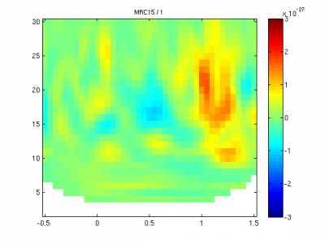

* TOC
{:toc}

Time-frequency analyses in [OAT](#oat.md) can be performed using the Hilbert transform, Morlet transform, or taper methods (Hanning or DPSS, as implemented in Fieldtrip).

You can choose the transform you require by setting `oat.first_level.tf_method`, to 'hilbert', 'morlet', or 'multitaper' (for Fieldtrip taper methods). The other options you need to set depend on the transform you choose. 

Some information about the various transforms is available in a [set of slides]({{ site.baseurl }}/downloads/oat_tf_transform.pdf)

### Taper transforms (Hanning and DPSS)

OSL borrows Fieldtrip's methods for taper-based time frequency transforms.  The [Fieldtrip website](http://www.fieldtriptoolbox.org/tutorial/timefrequencyanalysis) is a useful source of information about these methods.  Their time-frequency tutorial may be the best place to start.

There are a variety of decisions to be made in choosing options for the fieldtrip functions.  To supplement the fieldtrip tutorial documentation, the notes below describe how OSL deals with these decisions.

#### Using fieldtrip's time-frequency analysis functions with OSL

It is possible to specify a set number of oscillatory cycles to fit within the analysis time window at each frequency in the tf analysis, and create variable length time windows on that basis. For example, if 7 cycles were requested:

- at 30 Hz, time window is 233ms long
- at 10Hz, time window is 700ms long
- at 2Hz, time window is 3.5 seconds long

The tf value can only be computed for a given time point if a full time window can be fitted into the data window around that time. For example, with a 7 cycle time window, at 0.5 s from the beginning of the data that is available, the 30Hz and 10Hz values are computable, but the 2Hz value is not, and fieldtrip would produce a NaN for this t-f point.
One way of addressing this issue is to allow the time-frequency functions to return NaNs if the time window is too long for the data window provided, in which case we get TF plots that look like this, in which for low frequencies some data is missing:

{:style="max-height: 400px;"}

However, we want to avoid passing NaNs to the GLM in OSL, so we need to set things up so that we don't get any NaNs from the tf functions.

The tf always has to be computed over a time window of some non-infintesimal length, so ultimately we have to choose time windows that are compatible with (a) the length of data we have in the epoch, (t2 - t1) and (b) length of time over which we wish to compute tf estimates, (tTF2 - tTF1). (b) always has to be shorter than (a).

We could choose a fixed window length, e.g. 500ms. In this case, we know that the time over which we can compute the tf is tTF1 = t1 + 250ms; tTF2 = t2 - 250ms.

This approach involves compromises for low and high frequencies. At 2Hz we only have one cycle in the time window - and we couldn't expect to get a good estimate of the power. At 30Hz we have 15 cycles in the time window, and we could probably afford to cut this down and get a better temporal resolution for the tf estimate.

If we specify window lengths depending on number of cycles, then we might lose out on lower frequencies which we'd be keen to analyse with less cycles per window length, on the understanding that our estimate isn't going to be great.

An additional constraint when choosing a fixed window length is that a whole number of cycles need to fit within the window. So, for 500ms, we can only analyse 2Hz, and multiples of 2Hz.

Taking this all into account, we might want to go for a hybrid strategy:

- define a maximum window length.
	- this limits the length of tf data that can be produced for a given length of epoched data. E.g. for 500ms, our tf data will be (epoch length - 500ms) long.
	- this also determines the frequency resolution. E.g.
		- for a 500ms window, resolution is 2Hz (1/0.5); we can analyse a minimum frequency of 2Hz.
		- for a 700ms window, resolution is 1.4Hz (1/0.7); we can analyse a minimum frequency of 1.4Hz.
- define a number of cycles per window at which we begin to shrink the window length to accomodate a fixed number of cycles, improving temporal resolution of the tf estimate.
define a range of frequencies over which to analyse. We can set the frequencies by specifying the frequency range (e.g. [2 30] Hz) and the number of frequencies (e.g. 20).

For example, in OSL the following options give rise to the following scheme:

- `oat.first_level.tf_multitaper_twin = 0.5;`
- `oat.first_level.tf_multitaper_cycles = 7;`
- `oat.first_level.tf_freq_range = [2 30];`
- `oat.first_level.tf_num_freqs = 15;`

Frequency / Hz|Window length / ms|Cycles within the window
:-|:-|:-
2|500|1
4|500|2
6|500|3
8|500|4
10|500|5
12|500|6
14|500|7
16|438|7
18|389|7
20|350|7
22|318|7
24|291|7
26|269|7
28|250|7
30|233|7

In the example above, the frequency resolution and the frequency scale happened to match. This needn't be the case. We might need to shrink the time window a little for low frequencies to accomodate an integer number of cycles at each frequency.

For example, in OSL the following options give rise to the following scheme:

- `oat.first_level.tf_multitaper_twin = 0.5;`
- `oat.first_level.tf_multitaper_cycles = 7;`
- `oat.first_level.tf_freq_range = [2 30];`
- `oat.first_level.tf_num_freqs = 10;`

Frequency / Hz|Window length / ms|Cycles within the window
:-|:-|:-
2|500|1
5.11|391|2
8.22|487|4
11.33|441|5
14.44|485|7
17.55|399|7
20.66|339|7
23.78|294|7
26.89|260|7
30|233|7

In this case, the window lengths have been chosen to match the largest integer multiple of the corresponding frequency that does not exceed 0.5s.

If `S.tf_multitaper_cycles` is unset, rather than shrinking the time windows above a certain point, OSL will choose the largest possible time window that is an integer multiple of cycles for a given frequency, and that does not exceed the maximum time window.
If the frequency range of interest was fairly high - e.g. 18-30 Hz, then we might never need to restrict the maximum time window. In this case, just set `oat.first_level.tf_multitaper_ncycles`. The maximum time window, `oat.first_level.tf_multitaper_twin`, will be automatically be set to

	oat.first_level.tf_multitaper_cycles./(oat.first_level.tf_freq_range(1))

#### Setting time windows

`oat.first_level.tf_multitaper_twin` sets a limit on the time points at which the tf transform can be performed. Specifically, if the data time window is t1 to t2, then the viable time windows for the tf is bounded by:

- `tTF1 = t1 + (oat.first_level.tf_multitaper_twin ./ 2)`
- `tTF2 = t2 - (oat.first_level.tf_multitaper_twin ./ 2)`

The step size, over which the tf window is moved to compute each new tf point, can be specified either by setting `oat.first_level.tf_downsample_factor` (a divisive factor), or by setting `oatin.first_level.tf_time_step` (in seconds). These are different ways of setting the same variable, though the former way of specifying the timestep depends on the sample rate (e.g. if the sample rate is 500Hz, and `oat.first_level.tf_downsample_factor` is 10, the 'sample rate' in the tf wil be 500/10 = 50 Hz, i.e. equivalent to setting a timestep of 0.02 seconds).
In OSL, the time points at which the tf is performed are:

- `tTF1`
- `tTF1 + oatin.first_level.tf_time_step`
- `tTF1 + 2*oatin.first_level.tf_time_step` ... up until the last timepoint which is not greater than tTF2.
