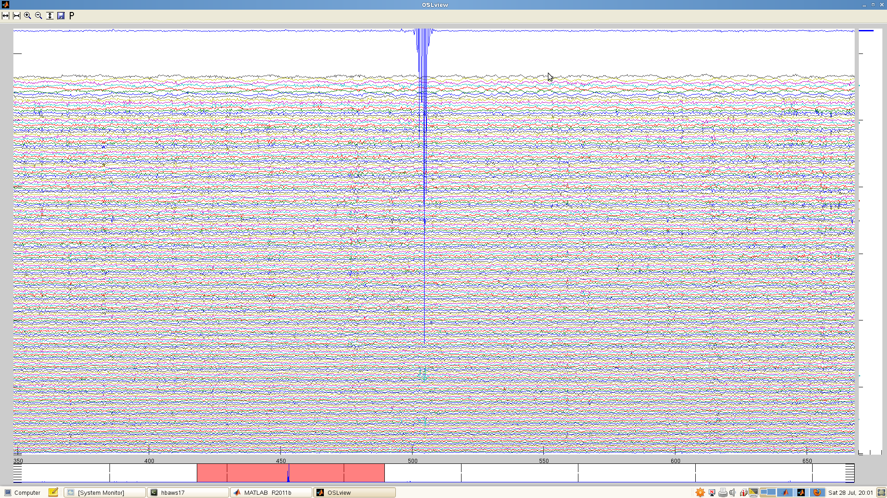
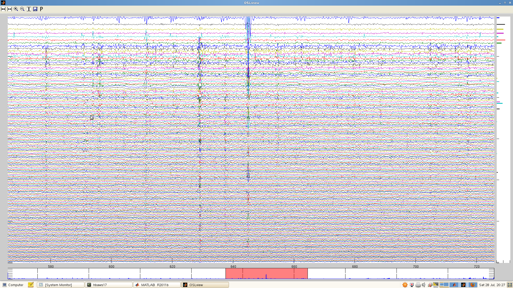
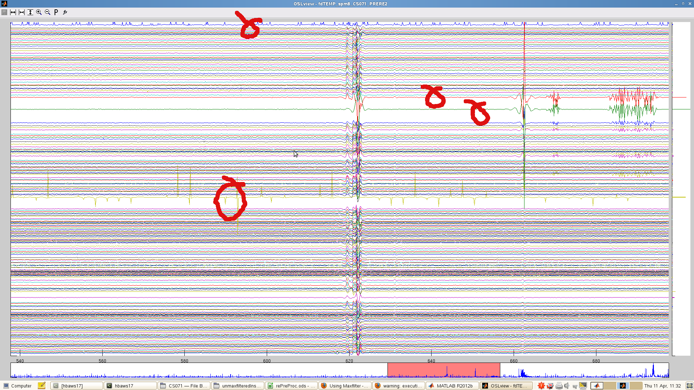
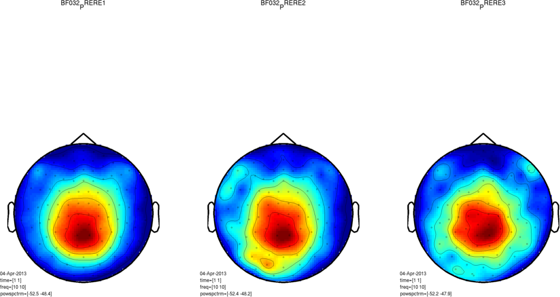
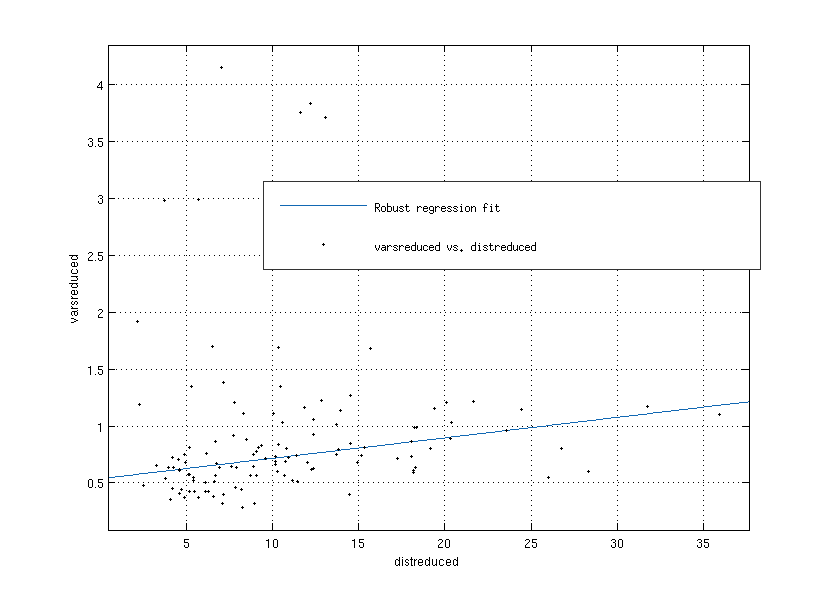
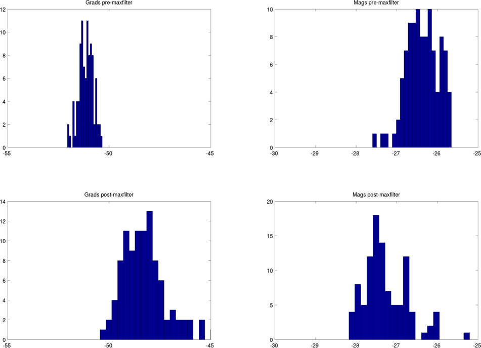
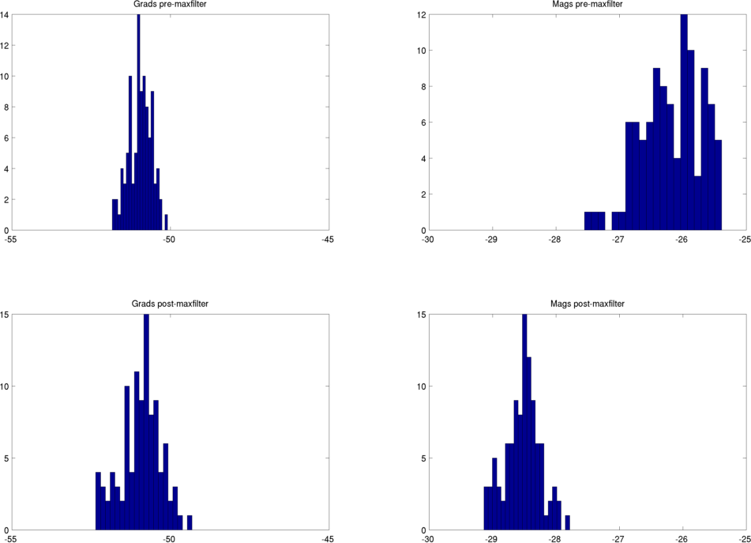
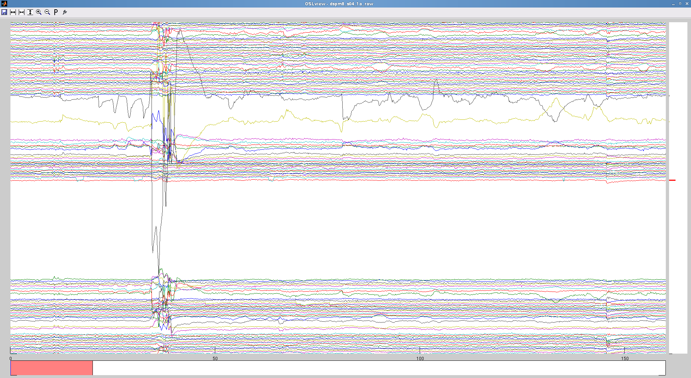
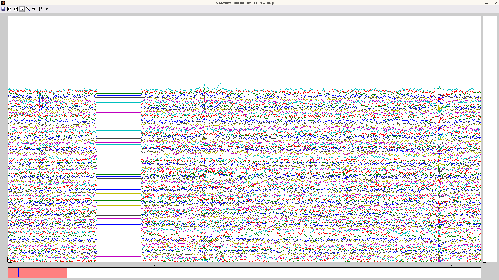

* TOC
{:toc}

## What is the MaxFilter?

Maxfilter is a program provided by Electa, which implements a spatial signal space separation (SSS) algorithm to remove external noise from MEG recordings.  See the [Maxfilter manual]({{ site.baseurl }}/downloads/maxfilter_user_guide.pdf) for details of the algorithm.

In addition to SSS denoising, and as part of the SSS algorithm, the maxfilter is able to correct for movements and differences in head position between subjects, re-projecting the data onto the MEG sensors as if the data had been recorded with the head in a different position.

Maxfilter can also detect bad channels, downsample data, output log files for head position, and other things besides - see the manual for the full set of options.

The latest version of maxfilter (as of 10th April 2013) is Maxfilter 2.2.  Be sure you are using this latest version, as previous versions contain bugs which are fixed in the current version.

In addition to this page, you might want to check out the [CBU MEG wiki](http://imaging.mrc-cbu.cam.ac.uk/meg) for maxfilter tips.

**Take care when maxfiltering your data!**

Maxfilter can be temperamental, and it needs to be used with care.  It's a 'black box', and as such there's a temptation to feed it some data, set a few options, and assume it'll work.  Don't take that for granted!  The input to the maxfilter needs to be specified carefully, and the output needs to be sanity-checked.  Just because it ran, doesn't mean it worked!

## How to use the Maxfilter

Maxfilter comes with a GUI, but you're almost certainly going to want to call it from matlab, via a system command.  A basic call from MATLAB, with no options set, might look like this:

	mf_cmmd = '/neuro/bin/util/maxfilter  -f /net/aton/data/my_meg_project/case_666/11041923/attention_task_session1.fif -o /home/me/disk3/data/preprocessing/sub1_sess1.fif'
	dos ( mf_cmmd );

You will definitely want to capture the text log from the maxfilter.  If you run maxfilter as above, the log will output to the command line (probably too rapidly to view) and be lost forever!  It's very important to redirect this output to a text file you can inspect later.  For example, you could add this to the end of your maxfilter call:

	-v  >& /home/me/disk3/preprocessing/sub1_sess1_mf_logfile.txt

This will redirect everything - the output and the standard errors/warnings - to the same file.  The `-v` means 'verbose'.  The warnings will be peppered somewhat randomly into the output.  If you're maxfiltering many subjects, it can be convenient to collate the warnings into a single file.  Go to the last common folder in the path to your log files, and do something like:

	grep -E 'preprocessing|Warning' */*mfLog* | perl -n -e 'chomp; /.+\.txt:(.+)/ and print "$1\n";' > /home/me/disk3/data/preprocessing/collatedWarnings.txt

This picks out all the lines with a warning, and also the lines that identify the subject that was maxfiltered. You'll need to replace the highlighted segments with something appropriate to your own data.  In particular, `preprocessing` should be replaced with the name of the last common folder in the path to the maxfiltered data files.  This allows `grep` to find the lines in the logfile that refer to the maxfiltered outfiles.  Thanks to Sven for this command!

Further options - and their associated pitfalls - are discussed in the linked pages below.

## Bad channels

Maxfilter can to detect bad channels in your data. You can toggle automatic bad channel detection by adding `-autobad` on to your maxfilter call.  However, it does not always detect all channels that contain artefacts.  _If a channel with artefacts does slip through, maxfilter can propagate this noise into other channels in the dataset._ To avoid this, you need to pick out bad channels and tell maxfilter about them using the `-bad` option.  You can do this manually, and to that end the maxfilter pipeline is:

1. Convert data to SPM format, with a high pass filter from ~0.5Hz (this is to remove slow drift that would otherwise make OSLview hard to use).  You will also want to downsample the data to reduce the time taken to load with OSLview.
2. View data in OSLview and manually tag channels with large jump artefacts
3. Run maxfilter specifying the bad channels you selected with the `-bad` option

Alternatively, you can use an ICA approach to reject bad channels automatically.  It's possible that channels with small electronic glitches won't be easily detectable by eye, but their characteristic timecourse may make them stand out as a single-channel ICA component.  See `osl_detect_badchannels` for an ICA tool to pick out misbehaving channels (developed by Dante Mantini).

**What kind of artefact do we need to worry about?**

There will be differences in variance between channels due to sources of signal noise, whether physiological or external.  This is the noise that maxfilter is built to deal with, and you don't need to worry about this.  The artefacts that can throw maxfilter are artefacts arising from the scanner electronics.  These often look like 'jumps' in the data, with sudden vertical shifts, often followed by an exponential-looking decay back to normal. After downsampling they may look like 'wavepackets'.  For example, here's a segment of data in which there's a single channel with a large artefact:

If you look closely at the above, you can see that there are also a few channels lower down (in light green) that appear to share this artefact.  In some cases, the artefact will propagate to many channels.  For example:

In this case, you can't afford to reject all the channels that carry the artefact.  Instead, this data segment will need to be rejected after maxfilter (which you can do with OSLview).  In many datasets, there will be one or a few channels that carry large artefacts that are either absent or much smaller in the rest of the channels, and these are the ones you want to reject at this stage.  

Here's an example in which there is a smorgasbord of artefacts.  The channels that were rejected are indicated.  More channels were rejected in an earlier run, but the data would not then maxfilter (see [What if maxfilter does not output any data](#what-if-maxfilter-does-not-output-any-data)), so it was necessary to be quite conservative.

## Head movements

It's [advisable to compensate for head movements in your MEG data](http://www.sciencedirect.com/science/article/pii/S1053811912011597).

Maxfilter can compensate for head movements in your data by reprojecting the data onto the sensors as if it had been recorded with the head in a different position.  This functionality can be used in two ways:

1. to continuously compensate for movments made within a recording session
2. to bring different sessions / subjects into a common frame, making the sensor-space results more comparable between sessions / subjects.

Option (1) requires that the HPI signal from the coils was recorded continously during the MEG session.  It is invoked using the option `-movecomp`.  A recomended call is:

	-movecomp inter -hpistep 200

This translates as "do movement compensation, using the last known position if the HPI fails.  Extract the HPI position every 200ms'

Option (2) is invoked using the `-trans` setting.  This allows you to transform the head position to match the position in another `.fif` file, or to the default position. **Do not use the default position** - this is likely to damage your data; see [Failure when attempting to compensate large movements](#failure-when-attempting-to-compensate-large-movements), below.

This option is used by specifying the `.fif` file you'd like to match (for head position).  For example:

	-trans /net/aton/data/my_meg_project/case_666/11041923/attention_task_session1.fif

## Failure when attempting to compensate large movements

If you use the `-trans` option and the movement compensation involves a large transformation (>3cm), the maxfilter can fail, and will considerably amplify the variance in the channels close to the vertex.  You might not notice this in sensorspace, as you're likely to be using a relative baseline.  In principle this can happen within session, so it's important to check that there isn't a very large movement within session for a given subject.  The maxfilter will also throw a warning if it is being asked to do a too-large shift.  It may be worth also checking the variance distribution in your data after maxfilter - you can adapt [this tool](maxfilter_makeStdTopo.m) to plot the topography of the variance in the combined gradiometers.  Here are three sessions from one subject in which the variance was amplified at the vertex:

If you still want to `-trans` to a common position across subjects/sessions, one strategy is to find a subject close to the median head position, and `-trans` to that subject's `.fif` file.

Whatever you do, be sure to check the output for single subjects. **Even if you use no movement compensation at all**, you may still find the maxfilter distorts that subject's data (without throwing an error).  See [pitfalls](#further-pitfalls-when-maxfiltering).

Across 120 recording sessions, there was a correlation between the degree of variance change in the gradiometers pre/post maxfilter and the distance of a given session's head origin from the median head position, but subjects with high variance changes were present even when the position shift was small.  The x-axis in this figure is the distance in mm of the initial HPI fit for a given session from the median head position across all of the sessions, and the y-axis is the mean absolute ln(variance) change in the gradiometers pre/post maxfilter.

These outlier subjects must be detected by carefully inspecting your data post-maxfilter.

## Further pitfalls when Maxfiltering

In addition to the potential problems with head position and badchannels, there are further pitfalls to watch out for when maxfiltering

## Channel variance distortion

Even if you have not used the MaxMove options (see [Head position (MaxMove)](#head-movements)) you may still find that maxfilter distorts the channel variance in your data.  For example, here are two different recording sessions from a single subject, maxfiltered without setting `-trans` or `-movecomp`.  Before/after maxfilter histograms of ln(channel variance) are shown.  Gradiometers are plotted on the LHS and magnetometers on the RHS.  The maxfilter always reduces the variance in the magnetometers, probably because they are more susceptible to external noise than the gradiometers.  The gradiometer variance is typically similar pre and post maxfilter, but for the first session shown here, the gradiometer variance is increased following maxfilter.  This isn't the case for the second session.

**Session 1 - gradiometer variance amplified**

**Session 2 - typical pre/post variance distributions**

There were no warnings thrown by the maxfilter for the first session.  It's important to check your data for distortion post-maxfilter!

You may also wish to check your head points.  Maxfilter performs a sphere-fit to these points, and this may have failed.  You can use [this tool](maxfilter_getHPIpoints.m) to get the cardinals, HPI coil locations, and head points.

## Zeros in maxfiltered data

Maxfilter sometimes spits out zeros.  It tends to set all channels to zero over a data buffer (or several buffers).  This is visible in OSLview, and zero-d segments can be rejected as bad epochs - but, be warned!  Short periods where the data are set to zero can be easy to miss.  Look at the cross-channel variance at the bottom of the OSLview display - zero-ed segments are visible here as a 'drop-out' in the variance trace.

In the maxfilter log file, you will see this warning if maxfilter has written zeros:

	Warning: 13 bad channels, the output data are set to zero! (t = 827.000)
	Warning: 13 bad channels, the output data are set to zero! (t = 828.000)
	Warning: 13 bad channels, the output data are set to zero! (t = 829.000)
	Warning: 13 bad channels, the output data are set to zero! (t = 830.000)

## What if maxfilter does not output any data

Sometimes maxfilter refuses to output data, in which case you'll see an error something like:

	EXIT 6: Output file /home/gwallis/data/megandata/megdata/mf_median/FL142/FL142_PRERE2_mf.fif was not written.

The body of the maxfilter output might look like this:

	--- Reading raw tag #b = 994/996 (#t = 997.000) ---
	Static bad channels (13): 111 112 113 122 1432 1532 1542 1543 1632 2612 2621 2622 2623
	Skipped 1 bad data tags.

The most likely cause is setting too many bad channels.  More than about 10 or 15 and maxfilter may crash out.  If this is the case, you'll see something like this warning scattered around the logfile:

	Warning: 13 bad channels, the output data are set to zero! (t = 45.000)
	Warning: 13 bad channels, the output data are set to zero! (t = 46.000)
	Warning: 13 bad channels, the output data are set to zero! (t = 47.000)
	Warning: 13 bad channels, the output data are set to zero! (t = 48.000)

Presumably you specified those bad channels for a reason - but if you want to maxfilter this data, you will have to go back and redo the bad channel selection more conservatively.

## Skipping data with Maxfilter

If you data contains noisy time-periods (for example you kept recording while you gave the participant a break and they moved around, masticated etc.), then before you do a proper Maxfilter (Elekta data only), you can use a function to remove these bad timeperiods ('bad_epochs'). Esentially Maxfilter will set these time chunks to zero and ignore them. This process is easy in theory, but cumbersome in practice, so please read the instructions below to make sure that you are not caught in a web of frustration. 

1. convert your raw `.fif` file to a format that OSL can read (ie: SPM format).
2. open this in OSLVIEW
3. identify bad time periods (see figure for example of noisy data that is best removed, before and after applying skip).
4. run Maxfilter on this `.fif` file, with settings `nosss=1` AND `logfile=1`. this will give you a timestamp for the start of the recording, that Elekta considers time zero. and no, it's not 0, it can be any number and will change across sessions and people (ie: don't try to predict it). in the logfile, look for something like `#initial` timestamp 
5. add this timestamp value to the bad time-periods you noted on oslview (ex: `[100 200]` is what you want to exclude; `Elekta #53`; your settings in Maxfilter are: `bad_epochs = [153 253]`)
6. run maxfilter with normal settings (`SSS*`, `movement_compensation` on if you recorded HPI etc.) and include `bad_epochs = [t1 t2]`. note if you want to exclude multiple times run it as `bad_epochs = [t1 t2; t3 t4]`. it is worth running this with `autobad_off=1`, as some of the bad channels it would pick up would be the side-effect of the bad time-periods. 
7. convert this skipped `.fif` and open in OSLview to manually mark bad channels (optional if you followed advice in previous step)
8. enjoy clean data!

Note: if you are using maxfilter remotely, you need to patch you `osl_call_maxfilter_remote` script with the one [here](maxfilter_osl_call_maxfilter_remote.m). this one includes the `bad_epochs` call. if you do not see the time-windows specified set to zero, it means you do not have this `bad_epochs` function in your script! 
