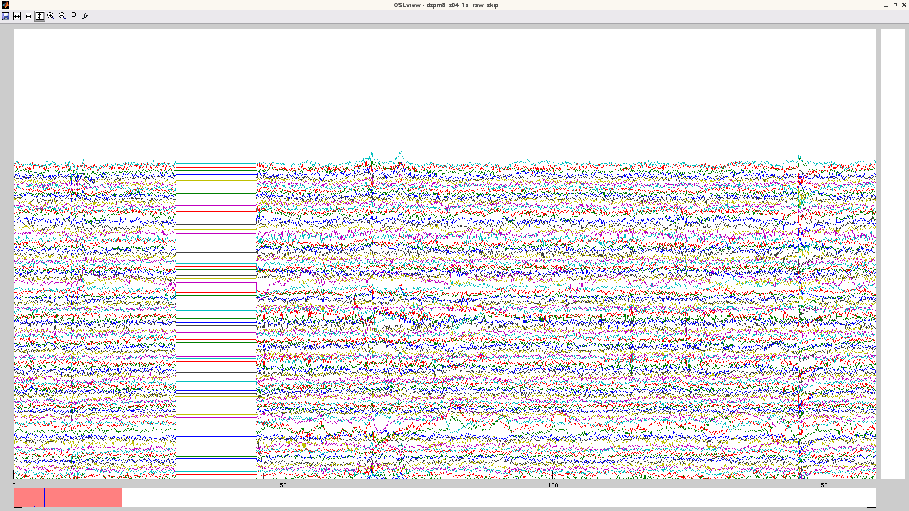

_Moved from Google Sites wiki_

_Todo - some content is now duplicated from tutorials, should link to them instead_

* TOC
{:toc}

### Preprocessing

{:style="max-height: 400px;"}

The recommended OSL preprocessing pipeline is as follows:

1. For Elekta data: "Double Maxfilter Procedure" (including some downsampling, e.g. to 250 Hz)
2. Conversion from input file format into SPM
3. Downsampling
5. AFRICA denoising 
6. High pass filtering
7. Removal of artefact time periods and channels*
8. Coregistration and Forward Modelling (needed if intending to do subsequent analysis in source space)
9. Epoching (if epoched data analysis)
            a.	Outlier trial rejection

This pipeline can be run through in two different ways:
Fully automated preprocessing tool, OPT (recommended).
Manually step-by-step with manual intervention.
The default recommendation is to use the fully automated pipeline using OPT.
Automated Pipeline: Using OPT

The second pipeline calls the fully automated preprocessing tool, OPT.

The script that you can go through is called:

osl_example_preprocessing_opt.m

and can be found in the OSL matlab directory. This script can easily be adapted to run on your own data.

Manual Pipeline

This pipeline is run manually step-by-step with manual intervention. An example script that you can go through is called:

osl_example_preprocessing_manual_full.m

and can be found in the OSL matlab directory. This script can easily be adapted to run on your own data.

Template script 

There is a template script for running this pipeline in the OSL directory called:

    osl_example_preprocessing_full_pipeline.m

*if continuous data then you can mark bad time chunks/ channels in OSLview
however, for epoched data, you will need to use the 'skip' function in Maxfilter to remove bad timeperiods before running Maxfilter again with bad channels marked. then you can continue with normal preprocessing, such as AFRICA (available as automated or manual)

### AFRICA

OSL provides a framework for employing Independent Component Analysis (ICA) to remove certain artefacts from MEG data. Using this framework, sources of interference, such as eye-blinks, ECG and line noise, can be separated from the genuine MEG data and removed.

To use ICA denoising, you will use the function osl_africa.m. osl_africa can currently be applied to Elekta Neuromag and CTF data.

The de-noising process has three stages:
Decomposition of data into independent components.

Here, the MEG data is extracted from the SPM object.
Each sensor type is normalised by its smallest eigenvalue.
Bad epochs (as defined by OSLview), bad trials and bad channels are removed.
fastica is used to decompose the data into a set of independent time courses and associated topographies.
The default parameters are recommended.

Classification of artefact components

This stage will require user-input.

Subtraction of artefact components from data to yield denoised data.

This final stage is automated and should not require any user input.
The independent time courses are subtracted from the MEG data. This is implemented via the spm_eeg_montage function which means that subsequent leadfields will be corrected.

Component identification using the manual GUI:

AFRICA can display the components graphically and allow you to interactively view and mark components as good/bad using a graphical user interface (GUI). This can be enabled using the following setting in AFRICA:

S.ident.func = @identify_artefactual_components_manual

The GUI appears at stage 2 in the above list and will save the selection and proceed with stage 3 once the window is closed. The GUI will look as below:

{:style="max-height: 400px;"}

AFRICA manual GUI

Guideline Description of AFRICA (e.g. for methods sections in papers)

Independent component analysis (ICA) was used to decompose the sensor data for each session into 150 temporally independent components (tICs) and associated sensor topographies using FastICA (http://research.ics.aalto.fi/ica/fastica). Artifact components were classified via the following procedure. Eye-blink, cardiac and mains interference components were manually identified by the combined inspection of the spatial topography, time course, kurtosis of the time course and frequency spectrum for all components. Eye-blink artifacts typically exhibited high kurtosis (>20), a repeated blink structure in the time course and very structured spatial topographies. Cardiac component time courses strongly resembled the typical ECG signals, as well as having high kurtosis (>20). Mains interference had extremely low kurtosis (typically <−1) and a frequency spectrum dominated by 50 Hz line noise. Artefacts were then rejected by subtracting them out of the data.

Here are some examples of artefacts:

ECG
{:style="max-height: 300px;"}

EOG
{:style="max-height: 300px;"}

Mains
{:style="max-height: 300px;"}

### Co-registration and Forward Modelling

This is required to be run before using OAT or OIL to do a source reconstruction analysis in brain space.

Co-registration is carried out, along with the forward modelling, using a call to osl_forward_model.m. This is a wrapper calling an SPM batch script. An example call for the Elekta Neuromag VectorView system is:

    S2=[];

    S2.fid_label.nasion='Nasion';        
    S2.fid_label.lpa='LPA';
    S2.fid_label.rpa='RPA';

    S2.D = spm_files{i};    % requires .mat extension    
    S2.mri=structural_files{i}; % set S2.sMRI=''; if there is no structural available        
    S2.useheadshape=1;

    S2.forward_meg='Single Shell';

    D=osl_forward_model(S2);

The co-registration stage will link together the head meshes, MEG sensors, and fiducials in a common coordinate system:
        
{:style="max-height: 400px;"}

You should always look at the result of the co-registration, via a call to spm_eeg_inv_checkdatareg(D). You should always make sure you check the results look reasonable! The figure produce by spm_eeg_inv_checkdatareg(D) shows everything co-registered in a common space: 
the MRI fiducials (pink diamonds), the sensor (HPI) fiducials (light blue), and the locations of sensors (green)
the the canonical cortical mesh (blue), inner skull surface (red) and scalp surface (light brown). 
Things to look out for are:
Are the headshape points (small red dots) well matched to the scalp surface?
Is the head sensibly inside the sensor array (green circles)?
Are the MRI fiducials (pink diamonds) located sensible close to the sensor (HPI) fiducials (light blue circles), and are they sensibly located with respect to the head?
Example Methods Description

Before acquisition of the MEG data, a three-dimensional digitizer (Polhemus Fastrack) was used to record each subject’s head shape relative to the position of the head position indicator (HPI) coils, with respect to three anatomical landmarks, or fiducials, which could be registered on the MRI scan (the nasion, and the left and right preauricular points). A structural MRI was also acquired.

Individual meshes (including scalp, inner skull and cortical surfaces) are generated from an individual subject’s structural MRI by applying the inverse of the same deformation field needed to normalize the individual structural image to an MNI template, to the canonical meshes derived from the MNI template [Mattout et al 2007]. Coregistration of the MEG sensor positions with the structural MRI and the meshes is then carried out via an approximate matching of the fiducials in the two spaces, followed by a more accurate surface-matching routine that fits the head-shape function (measured by Polhemus) to the scalp mesh. This procedure was carried out using scripts in the SPM8 package.
Mattout, J., Henson, R.N., Friston, K.J., 2007. Canonical source reconstruction for MEG. Comput. Intell. Neurosci. 67613.

Lead fields were computed using a single-shell head model (Nolte 2003) based on the inner skull mesh using scripts in the SPM8 package.

Nolte, G., 2003. The magnetic lead field theorem in the quasi-static approximation and its use for magnetoencephalography forward calculation in realistic volume conductors. Phys. Med. Biol. 48, 3637–3652.

Elekta Neuromag Grad Fix

After running osl_forward_model, IF you are using Elekta Neuromag data then a call to osl_neuromag_grad_baseline_correction is required to fix a current Fieldtrip bug. This corrects the way in which the gradiometers are scaled relative to the magnetometers (the Fieldtrip forward models are not accounting for the distance between the two gradiometer coils, which is 17mm). To fix this, you need to make a call along the lines of:

    D=osl_neuromag_grad_baseline_correction(spm_files{i},'vector_view');

Replace 'vector_view' with 'triux' if you have a Triux system.

### Coregistration using RHINO

RHINO (Registration of Headshapes Including Nose in OSL) is a tool for performing coregistration between the MEG landmarks (fiducials and headshape points marked using the Polhemus system) and the individual structural image. It addresses some limitations of SPM's inbuilt coregistration (detailed below) when using headshape points to refine the registration. 

What is coregistration all about?

In MEG/EEG analysis we have a number of coordinate systems including:

- Head coordinates as measured by the Polhemus system
- Device coordinates (MEG/EEG sensors)
- MRI coordinates of the individual structural MRI.
- (Optionally) MNI coordinates defined using a standard template brain

Ultimately we want everything to be in the same coordinate system. This is achieved using a number of linear or non-linear transformations, which are in computed by coregistering landmarks that are recorded in multiple coordinate systems. These coordinate systems, landmarks and transformations are summarised below:

{:style="max-height: 400px;"}

Good coregistration between these different coordinate systems relies on the landmarks being accurately recorded in both coordinate systems. Arguably the most sensitive step of this procedure is mapping between the Polhemus system and the individual structural MRI, since this requires the operator to accurately mark the fiducial points (typically nasion and left/right pre-auricular points) in both these spaces. Since this procedure can be prone to error, the surface of the head is often also digitised using the Polhemus system, and the coregistration refined by matched these points to the scalp surface extracted from the subject's structural image. 

Why does my coregistration look so bad?

As described above, a critical stage of the coregistration is matching the digitised points (fiducials and headshape points) in Polhemus space to the individual structural image. Given two sets of perfectly recorded fiducial landmarks this coregistration is straightforward. However, it is often challenging to accurately pinpoint the fiducial locations in both coordinate systems, thus we often rely on headshape points to refine the coregistration. This relies on:

1) Having accurate fiducial points. Although using headshape points to refine the registration places less reliance on the fiducial points these will provide an initialisation for the surface matching algorithm (Iterative Closest Point, or ICP). This algorithm is prone to local minima, so it is unlikely to recover from a poor initial fit.

2) Having an accurate extraction of the subject's head surface from their structural MRI. This in turn, requires that the sMRI has a field of view large enough to fully cover the head (NOTE: MRI operators not familiar with MEG often do not realise that the scalp and skull are important for MEG analysis and set the field of view to give maximum resolution of the brain by cropping the skull and scalp!).

3) Having a large number (>200) of Polhemus points. The surface matching algorithm is prone to local minima so it can often get stuck in poor fit. This problem is greater if there are less points from which to estimate the fit. 

4) Ensuring the Polhemus points cover the scalp, brow and (rigid parts of) the nose. The surface matching algorithm searches for the best fit of the polhemus points to the surface extracted from the sMRI. Since the scalp is approximately spherical, an apparently good fit of the Polhemus points to the data can be achieved even if the fit is severely rotated away from the true position. This can be avoided by including the nose, which both constrains the fit and makes it easier to determine whether the coregistration has gone awry. 

5) SPM's approach to extracting the headshape is not always accurate. SPM computes a nonlinear registration between the subject's structural image and the canonical brain and then warps the canonical scalp mesh using this transformation. However, since this transformation is primarily derived for the cortical meshes, it can result in distortions of the true head shape making it harder to match the Polhemus points. Furthermore, the warped canonical mesh does not model the nose, so there will be no surface for Polhemus points recorded from the nose to fit to (in fact, any Polhemus points from the nose may make the fit worse if SPM attempts to fit these points to other parts of the mesh). 

How can RHINO improve my coregistration?

RHINO improves on the default SPM coregistration in the following ways:

1) It extracts the full head surface, including the nose, allowing Polhemus points recorded from the nose to be fit to this surface.

2) It performs multi-start ICP to avoid local minima.

3) It extracts the scalp surface directly from the structural image to avoid distortion (this necessarily assumes the structural is distortionless).

##### Example of RHINO coregistration:

Below are visualisation of coregistrations performed using both SPM and RHINO for an example dataset in which the nasion fiducial point was poor. Note that the Polhemus points from the nose were excluded for the SPM coregistration, since the SPM scalp mesh does not contain the nose. At first glance the SPM registration appears to be reasonable, as the headshape points (red) lie approximately on the scalp mesh (orange). However, it is much easier to see that the RHINO fit is accurate, since the headshape points lie on the nose surface extracted from RHINO.

{:style="max-height: 300px;"}
{:style="max-height: 300px;"}

However, by overlaying these two coregistrations, it is clear that the fits are very different. Below are the two scalp surfaces and cortical surfaces registered using both SPM and RHINO. There is a rotation of ~20 degrees about the transverse axis. This difference will have a profound effect on source localisation as the brain will be in the wrong position as shown below (red & blue meshes: brain position using SPM & RHINO respectively).

{:style="max-height: 300px;"}
{:style="max-height: 300px;"}

Sounds good! How can I use RHINO?

The first thing to make sure is that you record good quality data! The importance of this cannot be overemphasised. This means:

- Obtaining a high quality structural MRI with full coverage of the headshape and nose. Don't just assume you'll be okay to use that dodgy old structural from an fMRI study your subject did.

- Mark the Polhemus fiducial points at their correct location! Familiarise yourself with where the LPA, RPA and nasion are.

- Collect loads of Polhemus points and make sure you cover the nose, brow and around the eyes if possible. You can use the Polhemus pen in continuous mode to quickly gather points. Ask an experienced user to help you if you don't know how to do this.

- Review the Polhemus headshape points before performing your coregistration. You can edit these points using osl_edit_fid.m to remove any stray points.

- Make sure the orientation information in the nifti file is correct. Sometimes, the orientation information in the nifti header is incorrect, for instance if it has been poorly converted from another format (e.g. DICOM). This can throw the RHINO fitting off, so review the anatomical markers (e.g. anterior/posterior) in FSLview.

- Ask an experienced user for the latest best practice guidelines.

Running RHINO

RHINO is run by call the osl function osl_headmodel, with the use_rhino flag turned on. For example:

	S = [];
	S.D                 = D.fullfile;
	S.mri               = [datadir '/structurals/struct1.nii'];
	S.useheadshape      = 1;
	S.use_rhino         = 1;
	S.forward_meg       = 'Single Shell';
	S.fid.label.nasion  = 'Nasion';
	S.fid.label.lpa     = 'LPA';
	S.fid.label.rpa     = 'RPA';
	D = osl_headmodel(S);

My data were collected before the new recommendations, what should I do?

If you have old data with a poor quality structural, or an inadequate number of headshape points, then you will have to lower your expectations of getting an accurate coregistration. However, there are some tricks you can do to make the most out of your data.

- If your structural has the nose:
In this case it may still be worth using RHINO, as you will be better able to see how good your coregistration is, and potentially correct it. In particular the nasion polhemus point should align well with the extracted scalp surface, and the LPA/RPA should be roughly symmetric and close to the expected locations on the scalp surface. If you have too few headshape points, the fit will likely be off. However, this can be manually corrected after running RHINO using rhino_manual.m which allows you to manually rotate and translate the head position using the cursor keys.

- If your structural doesn't have the nose:
In this case there is little benefit from using RHINO over the standard SPM tool, other than being able to better visualise and tweak the fit. However, in either case it is important to remove and polhemus points acquired from the nose using osl_edit_fid.m, since there will be no nose surface to match these points to, which may be detrimental to the fitting process.

### OPT (OSL's Preprocessing Tool) 

OPT is a fully automated pipeline for preprocessing MEG data. This automates as many of the analysis decisions as possible, and allows easy (though still robust, efficient and valid) analysis, whilst giving some flexibility if needed. 

OPT runs through the following pipeline steps (some of which can be optionally turned off):
    For Elekta Neuromag data: Runs the "Double Maxfilter Procedure" (to help Maxfilter with detection of bad channels):
Runs Maxfilter without SSS (with some intermediate downsampling to help with disk space/RAM)
Conversion of non-SSS data into SPM format
Automated detection of bad channels
Runs Maxfilter doing SSS (with some intermediate downsampling to help with disk space/RAM)
    Conversion of data into SPM format
    Completes the downsampling
    Automated AFRICA denoising
    High-pass filtering
    Removal of artefact time periods and channels (if continuous data analysis)
    Coregistration and Forward Modelling (needed if intending to do subsequent analysis in source space)
    Epoching (if epoched data analysis)
        Automated outlier trial and channel rejection
An example/template script for calling OPT is called:
    osl_example_preprocessing_opt.m

and can be found in the OSL matlab directory. This script can easily be adapted to run on your own data.

Combining multiple OPT runs (including adding new sessions or re-running subsets of sessions).

A common issue is running OPT separately on different sessions/subjects using separate calls to osl_run_opt for each one. This can happen when adding new sessions/subjects, or perhaps when re-running a "problem" session/subject.

For this to work, the key is keep the following opt settings fixed over each call to osl_run_opt: 
- the opt.dirname, and 
- the list of input files (e.g. opt.raw_fif_files or opt.input_files or opt.spm_files), other than concatenating any new sessions on at the end.
- the opt.*.do settings (e.g. opt.africa.do, or opt.downsample.do). 

To run OPT on different sessions in different calls to osl_run_opt, simple change the opt.sessions_to_do for each run. 

When all sessions have been run, you can then use a call to:

    opt=opt_consolidate_results(opt);

This will mine the opt directory and combine together the results it can find. It will also produce a consolidated OPT report.

### OSLview

See the OSLView tutorial [here]({{ site.baseurl }}/matlab/osl_example_oslview.html)

### Maxfilter

##### Skipping data with Maxfilter

If you data contains noisy time-periods (for example you kept recording while you gave the participant a break and they moved around, masticated etc.), then before you do a proper Maxfilter (Elekta data only), you can use a function to remove these bad timeperiods ('bad_epochs'). Esentially Maxfilter will set these time chunks to zero and ignore them. This process is easy in theory, but cumbersome in practice, so please read the instructions below to make sure that you are not caught in a web of frustration. 

1) covert your raw .fif file to a format that OSL can read (ie: SPM format).
2) open this in OSLVIEW
3) identify bad time periods (see figure for example of noisy data that is best removed, before and after applying skip).

4) run Maxfilter on this .fif file, with settings nosss=1 AND logfile=1. this will give you a timestamp for the start of the recording, that Elekta considers time zero. and no, it's not 0, it can be any number and will change across sessions and people (ie: don't try to predict it). in the logfile, look for something like #intial timestamp 
5) add this timestamp value to the bad time-periods you noted on oslview (ex: [100 200] is what you want to exclude; Elekta #53; your settings in Maxfilter are: bad_epochs = [153 253])
6) run maxfilter with normal settings (SSS*, movement_compensation on if you recorded HPI etc.) and include bad_epochs = [t1 t2]. note if you want to exclude multiple times run it as bad_epochs = [t1 t2; t3 t4]. it is worth running this with autobad_off=1, as some of the bad channels it would pick up would be the side-effect of the bad time-periods. 
7) convert this skipped .fif and open in OSLview to manually mark bad channels (optional if you followed advice in previous step)
8) enjoy clean data!

{:style="max-height: 400px;"}

Note: if you are using maxfilter remotely, you need to patch you osl_call_maxfilter_remote script with the one below. this one includes the bad_epochs call. if you do not see the time-windows specified set to zero, it means you do not have this bad_epochs function in your script!
Note:* see comments below about using tsss in conjunction with skip

##### Using Maxfilter

What is the MaxFilter?

Maxfilter is a program provided by Electa, which implements a spatial signal space separation (SSS) algorithm to remove external noise from MEG recordings.  See the maxfilter manual for details of the algorithm.

In addition to SSS denoising, and as part of the SSS algorithm, the maxfilter is able to correct for movements and differences in head position between subjects, re-projecting the data onto the MEG sensors as if the data had been recorded with the head in a different position.

Maxfilter can also detect bad channels, downsample data, output log files for head position, and other things besides - see the manual for the full set of options.

The latest version of maxfilter (as of 10th April 2013) is Maxfilter 2.2.  Be sure you are using this latest version, as previous versions contain bugs which are fixed in the current version.

In addition to this page, you might want to check out the CBU MEG wiki for maxfilter tips.

Take care when maxfiltering your data!

Maxfilter can be temperamental, and it needs to be used with care.  It's a 'black box', and as such there's a temptation to feed it some data, set a few options, and assume it'll work.  Don't take that for granted!  The input to the maxfilter needs to be specified carefully, and the output needs to be sanity-checked.  Just because it ran, doesn't mean it worked!

How to use the Maxfilter

Maxfilter comes with a GUI, but you're almost certainly going to want to call it from matlab, via a system command.  A basic call from MATLAB, with no options set, might look like this:

mf_cmmd = '/neuro/bin/util/maxfilter  -f /net/aton/data/my_meg_project/case_666/11041923/attention_task_session1.fif -o /home/me/disk3/data/preprocessing/sub1_sess1.fif'
dos ( mf_cmmd );

You will definitely want to capture the text log from the maxfilter.  If you run maxfilter as above, the log will output to the command line (probably too rapidly to view) and be lost forever!  It's very important to redirect this output to a text file you can inspect later.  For example, you could add this to the end of your maxfilter call:

-v  >& /home/me/disk3/preprocessing/sub1_sess1_mf_logfile.txt

This will redirect everything - the output and the standard errors/warnings - to the same file.  The -v means 'verbose'.  The warnings will be peppered somwhat randomly into the output.  If you're maxfiltering many subjects, it can be convenient to collate the warnings into a single file.  Go to the last common folder in the path to your log files, and do something like:

grep -E 'preprocessing|Warning' */*mfLog* | perl -n -e 'chomp; /.+\.txt:(.+)/ and print "$1\n";' > /home/me/disk3/data/preprocessing/collatedWarnings.txt

This picks out all the lines with a warning, and also the lines that identify the subject that was maxfiltered. You'll need to replace the highlighted segments with something appropriate to your own data.  In particular, 'preprocessing' should be replaced with the name of the last common folder in the path to the maxfiltered data files.  This allows grep to find the lines in the logfile that refer to the maxfiltered outfiles.  Thanks to Sven for this command!

Further options - and their associated pitfalls - are discussed in the linked pages below.

Bad channels

See bad channels and the maxfilter.

Head movements

See head position (MaxMove).

Pitfalls

In addition to the potential problems with head position and badchannels, there are further pitfalls to watch out for when maxfiltering: see Further pitfalls when Maxfiltering.