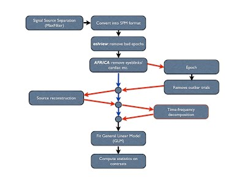
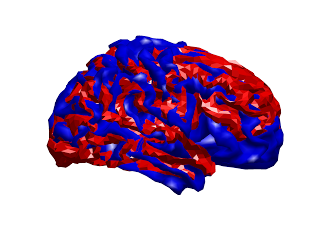

* TOC
{:toc}

## Preprocessing

{:style="max-height: 400px;"}

The _recommended_ OSL preprocessing pipeline is as follows:

1. For Elekta data: "Double [Maxfilter](preprocessing-maxfilter.md) Procedure" (including some downsampling, e.g. to 250 Hz)
2. Conversion from input file format into SPM
3. Downsampling
5. [AFRICA](#africa) denoising 
6. High pass filtering
7. Removal of artefact time periods and channels*
8. [Coregistration and Forward Modelling](#co-registration-and-forward-modelling) (needed if intending to do subsequent analysis in source space)
9. Epoching (if epoched data analysis)
            a.	Outlier trial rejection

This pipeline can be run through in two different ways:

- Fully automated preprocessing tool, [OPT](opt.md) (recommended).
- Manually step-by-step with manual intervention.

The default recommendation is to use the fully automated pipeline using OPT.

#### Automated Pipeline: Using OPT

The second pipeline calls the fully automated preprocessing tool, [OPT](opt.md).

The script that you can go through is called:

    osl_example_preprocessing_opt.m

and can be found in the OSL matlab directory. This script can easily be adapted to run on your own data.

#### Manual Pipeline

This pipeline is run manually step-by-step with manual intervention. An example script that you can go through is called:

    osl_example_preprocessing_manual_full.m

and can be found in the OSL matlab directory. This script can easily be adapted to run on your own data.

#### Template script 

There is a template script for running this pipeline in the OSL directory called:

    osl_example_preprocessing_full_pipeline.m

_Note: if continuous data then you can mark bad time chunks/ channels in OSLview. However, for epoched data, you will need to use the 'skip' function in Maxfilter to remove bad timeperiods before running Maxfilter again with bad channels marked. then you can continue with normal preprocessing, such as AFRICA (available as automated or manual)_

## AFRICA

OSL provides a framework for employing Independent Component Analysis (ICA) to remove certain artefacts from MEG data. Using this framework, sources of interference, such as eye-blinks, ECG and line noise, can be separated from the genuine MEG data and removed. 

[See the tutorial example on using AFRICA for detailed information.]({{ site.baseurl }}/matlab/osl_example_africa.html)

{:style="max-height: 400px;"}

Here are some examples of artefacts:

ECG

{:style="max-height: 300px;"}

EOG

{:style="max-height: 300px;"}

Mains

{:style="max-height: 300px;"}


## Co-registration and Forward Modelling

This is required to be run before using OAT or OIL to do a source reconstruction analysis in brain space.

Co-registration is carried out, along with the forward modelling, using a call to osl_forward_model.m. This is a wrapper calling an SPM batch script. An example call for the Elekta Neuromag VectorView system is:

```matlab
S2=[];

S2.fid_label.nasion='Nasion';        
S2.fid_label.lpa='LPA';
S2.fid_label.rpa='RPA';

S2.D = spm_files{i};    % requires .mat extension    
S2.mri=structural_files{i}; % set S2.sMRI=''; if there is no structural available        
S2.useheadshape=1;

S2.forward_meg='Single Shell';

D=osl_forward_model(S2);
```

The co-registration stage will link together the head meshes, MEG sensors, and fiducials in a common coordinate system:
        
{:style="max-height: 400px;"}


You should always look at the result of the co-registration, via a call to `spm_eeg_inv_checkdatareg(D)`. _You should always make sure you check the results look reasonable!_ The figure produce by `spm_eeg_inv_checkdatareg(D)` shows everything co-registered in a common space: 

- the MRI fiducials (pink diamonds), the sensor (HPI) fiducials (light blue), and the locations of sensors (green)
- the the canonical cortical mesh (blue), inner skull surface (red) and scalp surface (light brown). 

Things to look out for are:

- Are the headshape points (small red dots) well matched to the scalp surface?
- Is the head sensibly inside the sensor array (green circles)?
- Are the MRI fiducials (pink diamonds) located sensible close to the sensor (HPI) fiducials (light blue circles), and are they sensibly located with respect to the head?

#### Example Methods Description

Before acquisition of the MEG data, a three-dimensional digitizer (Polhemus Fastrack) was used to record each subject’s head shape relative to the position of the head position indicator (HPI) coils, with respect to three anatomical landmarks, or fiducials, which could be registered on the MRI scan (the nasion, and the left and right preauricular points). A structural MRI was also acquired.

Individual meshes (including scalp, inner skull and cortical surfaces) are generated from an individual subject’s structural MRI by applying the inverse of the same deformation field needed to normalize the individual structural image to an MNI template, to the canonical meshes derived from the MNI template [Mattout et al 2007]. Coregistration of the MEG sensor positions with the structural MRI and the meshes is then carried out via an approximate matching of the fiducials in the two spaces, followed by a more accurate surface-matching routine that fits the head-shape function (measured by Polhemus) to the scalp mesh. This procedure was carried out using scripts in the SPM8 package.

Mattout, J., Henson, R.N., Friston, K.J., 2007. _Canonical source reconstruction for MEG._ Comput. Intell. Neurosci. 67613.

Lead fields were computed using a single-shell head model (Nolte 2003) based on the inner skull mesh using scripts in the SPM8 package.

Nolte, G., 2003. _The magnetic lead field theorem in the quasi-static approximation and its use for magnetoencephalography forward calculation in realistic volume conductors._ Phys. Med. Biol. 48, 3637–3652.

#### Elekta Neuromag Grad Fix

After running `osl_forward_model`, IF you are using Elekta Neuromag data then a call to `osl_neuromag_grad_baseline_correction` is required to fix a current Fieldtrip bug. This corrects the way in which the gradiometers are scaled relative to the magnetometers (the Fieldtrip forward models are not accounting for the distance between the two gradiometer coils, which is 17mm). To fix this, you need to make a call along the lines of:

    D=osl_neuromag_grad_baseline_correction(spm_files{i},'vector_view');

Replace `vector_view` with `triux` if you have a Triux system.

## Coregistration using RHINO

RHINO (Registration of Headshapes Including Nose in OSL) is a tool for performing coregistration between the MEG landmarks (fiducials and headshape points marked using the Polhemus system) and the individual structural image. It addresses some limitations of SPM's inbuilt coregistration (detailed below) when using headshape points to refine the registration. 

What is coregistration all about?


In MEG/EEG analysis we have a number of coordinate systems including:

- Head coordinates as measured by the Polhemus system
- Device coordinates (MEG/EEG sensors)
- MRI coordinates of the individual structural MRI.
- (Optionally) MNI coordinates defined using a standard template brain

Ultimately we want everything to be in the same coordinate system. This is achieved using a number of linear or non-linear transformations, which are in computed by coregistering landmarks that are recorded in multiple coordinate systems. These coordinate systems, landmarks and transformations are summarised below:

{:style="max-height: 400px;"}

Good coregistration between these different coordinate systems relies on the landmarks being accurately recorded in both coordinate systems. Arguably the most sensitive step of this procedure is mapping between the Polhemus system and the individual structural MRI, since this requires the operator to accurately mark the fiducial points (typically nasion and left/right pre-auricular points) in both these spaces. Since this procedure can be prone to error, the surface of the head is often also digitised using the Polhemus system, and the coregistration refined by matched these points to the scalp surface extracted from the subject's structural image. 

### Why does my coregistration look so bad?

As described above, a critical stage of the coregistration is matching the digitised points (fiducials and headshape points) in Polhemus space to the individual structural image. Given two sets of perfectly recorded fiducial landmarks this coregistration is straightforward. However, it is often challenging to accurately pinpoint the fiducial locations in both coordinate systems, thus we often rely on headshape points to refine the coregistration. This relies on:

1. **Having accurate fiducial points.** Although using headshape points to refine the registration places less reliance on the fiducial points these will provide an initialisation for the surface matching algorithm (Iterative Closest Point, or ICP). This algorithm is prone to local minima, so it is unlikely to recover from a poor initial fit.
2. **Having an accurate extraction of the subject's head surface from their structural MRI.** This in turn, requires that the sMRI has a field of view large enough to fully cover the head (NOTE: MRI operators not familiar with MEG often do not realise that the scalp and skull are important for MEG analysis and set the field of view to give maximum resolution of the brain by cropping the skull and scalp!).
3. **Having a large number (>200) of Polhemus points.** The surface matching algorithm is prone to local minima so it can often get stuck in poor fit. This problem is greater if there are less points from which to estimate the fit. 
4. **Ensuring the Polhemus points cover the scalp, brow and (rigid parts of) the nose.** The surface matching algorithm searches for the best fit of the polhemus points to the surface extracted from the sMRI. Since the scalp is approximately spherical, an apparently good fit of the Polhemus points to the data can be achieved even if the fit is severely rotated away from the true position. This can be avoided by including the nose, which both constrains the fit and makes it easier to determine whether the coregistration has gone awry. 
5. **SPM's approach to extracting the headshape is not always accurate.** SPM computes a nonlinear registration between the subject's structural image and the canonical brain and then warps the canonical scalp mesh using this transformation. However, since this transformation is primarily derived for the cortical meshes, it can result in distortions of the true head shape making it harder to match the Polhemus points. Furthermore, the warped canonical mesh does not model the nose, so there will be no surface for Polhemus points recorded from the nose to fit to (in fact, any Polhemus points from the nose may make the fit worse if SPM attempts to fit these points to other parts of the mesh). 

### How can RHINO improve my coregistration?


RHINO improves on the default SPM coregistration in the following ways:

1) It extracts the full head surface, including the nose, allowing Polhemus points recorded from the nose to be fit to this surface.

2) It performs multi-start ICP to avoid local minima.

3) It extracts the scalp surface directly from the structural image to avoid distortion (this necessarily assumes the structural is distortionless).

### Example of RHINO coregistration:

Below are visualisation of coregistrations performed using both SPM and RHINO for an example dataset in which the nasion fiducial point was poor. Note that the Polhemus points from the nose were excluded for the SPM coregistration, since the SPM scalp mesh does not contain the nose. At first glance the SPM registration appears to be reasonable, as the headshape points (red) lie approximately on the scalp mesh (orange). However, it is much easier to see that the RHINO fit is accurate, since the headshape points lie on the nose surface extracted from RHINO.

{:style="max-height: 300px;"}
{:style="max-height: 300px;"}


However, by overlaying these two coregistrations, it is clear that the fits are very different. Below are the two scalp surfaces and cortical surfaces registered using both SPM and RHINO. There is a rotation of ~20 degrees about the transverse axis. This difference will have a profound effect on source localisation as the brain will be in the wrong position as shown below (red & blue meshes: brain position using SPM & RHINO respectively).

{:style="max-height: 300px;"}
{:style="max-height: 300px;"}


### How to use RHINO

The first thing to make sure is that you record good quality data! The importance of this cannot be overemphasised. This means:

- Obtaining a high quality structural MRI with full coverage of the headshape and nose. Don't just assume you'll be okay to use that dodgy old structural from an fMRI study your subject did.

- Mark the Polhemus fiducial points at their correct location! Familiarise yourself with where the LPA, RPA and nasion are.

- Collect loads of Polhemus points and make sure you cover the nose, brow and around the eyes if possible. You can use the Polhemus pen in continuous mode to quickly gather points. Ask an experienced user to help you if you don't know how to do this.

- Review the Polhemus headshape points before performing your coregistration. You can edit these points using `osl_edit_fid.m` to remove any stray points.

- Make sure the orientation information in the nifti file is correct. Sometimes, the orientation information in the nifti header is incorrect, for instance if it has been poorly converted from another format (e.g. DICOM). This can throw the RHINO fitting off, so review the anatomical markers (e.g. anterior/posterior) in FSLview.

- Ask an experienced user for the latest best practice guidelines.

### Running RHINO

RHINO is run by call the osl function `osl_headmodel`, with the `use_rhino` flag turned on. For example:

```matlab
S = [];
S.D                 = D.fullfile;
S.mri               = [datadir '/structurals/struct1.nii'];
S.useheadshape      = 1;
S.use_rhino         = 1;
S.forward_meg       = 'Single Shell';
S.fid.label.nasion  = 'Nasion';
S.fid.label.lpa     = 'LPA';
S.fid.label.rpa     = 'RPA';
D = osl_headmodel(S);
```

### Working with old data

If you have old data with a poor quality structural, or an inadequate number of headshape points, then you will have to lower your expectations of getting an accurate coregistration. However, there are some tricks you can do to make the most out of your data.

- If your structural has the nose
    - In this case it may still be worth using RHINO, as you will be better able to see how good your coregistration is, and potentially correct it. In particular the nasion polhemus point should align well with the extracted scalp surface, and the LPA/RPA should be roughly symmetric and close to the expected locations on the scalp surface. If you have too few headshape points, the fit will likely be off. However, this can be manually corrected after running RHINO using `rhino_manual.m` which allows you to manually rotate and translate the head position using the cursor keys.
- If your structural doesn't have the nose
    - In this case there is little benefit from using RHINO over the standard SPM tool, other than being able to better visualise and tweak the fit. However, in either case it is important to remove and polhemus points acquired from the nose using `osl_edit_fid.m`, since there will be no nose surface to match these points to, which may be detrimental to the fitting process.

## OSLview

See the OSLView tutorial [here]({{ site.baseurl }}/matlab/osl_example_oslview.html)
