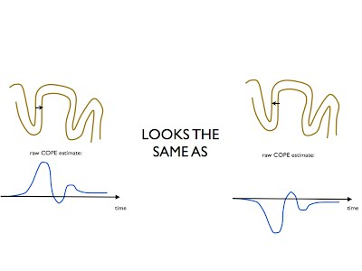

There is an ambiguity between the reconstructed dipole direction and the sign of the reconstructed ERF/activity time series, e.g.:

We need a way to do tests/comparisons that is insensitive to this ambiguity so that the COPEs are

- comparable over space (to allow viewing or averaging/smoothing over space)
- comparable over subjects (to allow averaging over subjects)

The current solution is to use rectification of the COPEs, i.e. abs(COPE). This is done using the `oat.first_level.cope_type='acope'` setting.

Note that:

- We also need to subtract the baseline (pre-stimulus) average abs(COPE) [i.e. setting `oat.first_level.bc` to one for all contrasts], so that we have distributions that are symmetric around zero; this allows for easier null hypothesis testing.
- We should not do any spatial averaging (e.g. over an ROI) before the ERF rectification, i.e. do any spatial averaging after the first-level stats have been computed.