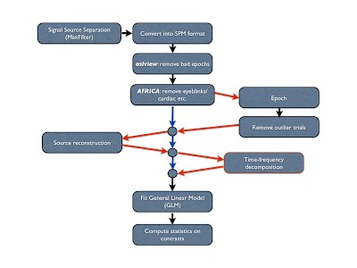

This site is a fairly standard GitHub Pages setup using Jekyll. Documents are served from the osl-docs repository. Most of the extras like page lists and navigation sections are handled automatically. Here are some of the common tasks

* TOC
{:toc}

### Making a new page

Make a new file anywhere - but best to put it in the `docs` folder. Start the file with

	---
	layout: default
	title: MyTitle
	resource: true
	categories: documentation
	---

The document will automatically be added to the navbar section corresponding to its category, and the title will also be placed at the top of the page content. After this header, write content in Markdown (the same as on GitHub wiki pages). 

### Making a new tutorial

1. Write the content in Matlab
2. Run `osl_publish` on your Matlab file
3. Add and commit the files in the `osl-docs` repository (NOT `osl-core`)

### Making a new nav section

Open `_config.yml`. There is a list of categories e.g.

	category-list: [overview,examples,documentation,archive]

Add your category to the list. It will appear in the navbar and any pages given that category will automatically be added to it

### Making a link to a page in the navbar

If you just want to link to a page in the navbar, edit `_includes/navigation.html`. There is a list that corresponds to the content of the navbar. Currently, the first item in the list is a link to the home page e.g.

	<li><a href="{{ site.baseurl }}/"">Home</a></li>

Add other links in the same way. Put them before or after the automatically generated set of dropdowns.

### Adding a table of contents

Put

	* TOC
	{:toc}

at the top of the page

### Adding an image

	{:style="max-height: 400px;"}

### Linking to a file

	[session3_ohba_workshop_osl_source_recon_2017.pdf]({{ site.baseurl }}/downloads/- session3_ohba_workshop_osl_source_recon_2017.pdf)

### Moving wiki content checklist

There is a lot of content on the old Google Sites wiki that needs to be ported over. Here is a checklist of known items that need to be verified

- Have all pages that appear in the sidebar been moved?
- For each page, have all subpages also been moved?
- Make sure all images have been copied
- Check that all links have been re-linked