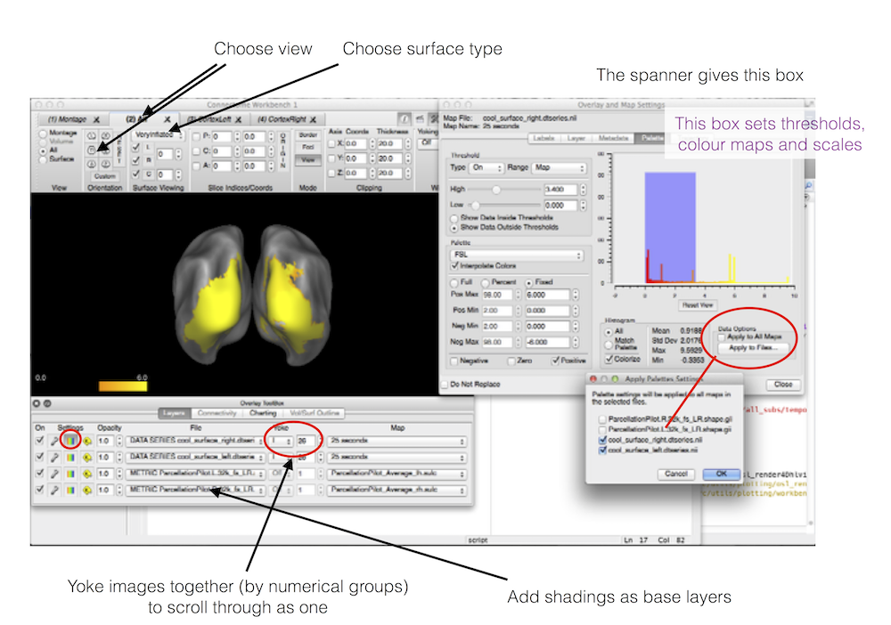

## Orthoviews

3D stats images (or 4D at particular time points) can be viewed (e.g. for printing) using `ortho_overlay_act` e.g.

```matlab
S=[];
S.mni_coord=[-10 20 14];
S.fname=tstatfname;
S.gridstep=2; % in mm
S.vol_index=90; % volume index
S.range=minmax{cc};
S.add_colorbar=0;
figure;
ortho_overlay_act( S )
```

## HCP workbench

{:style="max-height: 400px;"}

## Produce Freesurfer surface images

Freesurfer can be used to produce images of cortical (single time point) surfaces. Need to call `osl_render_vols_to_surf.m` with `S.type='free surfer'`, and an appropriate time window that will be averaged over.

For this to work you will need Freesurfer and ImageMagick installed. 

Example call:

```matlab
S=[];
S.time_indices=90; % volume index
S.vol=tstatfname; 
S.minmax=[3.5 8]; % range of values to show
S.type='freesurfer'; 
res = osl_render_vols_to_surf(S)
runcmd(['open ' res.left_tiff_names{1}]);    
runcmd(['open ' res.right_tiff_names{1}]);
```

## Produce Freesurfer surface movies

To produce .avi movie of 4D activity on a cortical surface, you can call `osl_make_surf_movie.m`

For this to work you will need Freesurfer and ImageMagick installed.

Example call:

```matlab
%% create movie
S=[];
S.vol=tstatfname;
S.minmax=[3.5 7]; % range of values to show
S.time_range=[0 2]; % in secs 
S.times=times; % vector of time points for each volumes in S.vol
[movie_fname vols2surf_results] = osl_make_surf_movie(S); %output is .avi file
```